# Memory Diagram — MDForge, forge documentaire modulaire et agent-native

## 1. Portée et niveau de vérité

Ce document fixe **l'architecture cible de réflexion et de conception** de MDForge avant la rédaction de ses Targets d'implémentation.

Il ne prétend pas que cette architecture est déjà implémentée.

### Vérité observée au baseline

Au SHA MDForge `a9023cc5efc96314d6590ed17e5fabe3bb6fdd61` :

- le repository est une coquille MDForge minimale ;
- `launch_mdforge.bat` délègue encore au sous-projet MDDOCX ;
- `Mddocx/` est un submodule au SHA `92095562b1d9b421c3c5cc7f761c16b74115c5a7` ;
- le manifest identifie déjà le produit comme `infrastructure:mdforge`.

Tout le reste de ce document est **architecture_target** : expectations, frontières, baseline technologique candidate et hypothèses de conception à transformer plus tard en Targets et preuves.

```text
OBSERVÉ
MDForge shell → MDDOCX

CIBLE
MDForge = forge composable autonome
MDDOCX = source historique d'exigences et de comportements
         → migration vers des capabilities MDForge
         → retrait après parité prouvée
```

## 2. Sources de vérité et ordre de lecture

```text
AGENTS.md
→ manifest.yaml
→ _/agents/INDEX.md
→ contrat Memory Diagrams
→ CE diagramme
→ futur(s) Target(s)
→ code / tests au SHA de mission
```

Quand le repository est monté dans TAKOUDJOU, les contrats institutionnels de Researches gouvernent la coordination et PACTE ; MDForge ne les recopie pas.

Le Target historique `target-mdforge-project-discovery` est un **design input** : il capture des cas d'usage opérateur précieux, mais ne prime pas sur le présent Memory Diagram pour les choix architecturaux. Ses intentions UX sont absorbées ici puis reformulées selon la doctrine cible.

## 3. Préséance

```text
Architecture future
  ce Memory Diagram
  > Targets dérivés
  > artefacts de mission

Existence réelle
  preuve reproductible
  > code/contrats au SHA chargé
  > documentation
```

Une API, une stack ou une capability imaginée ici n'existe pas tant qu'un Target ne l'a pas livrée et prouvée.

## 4. Vocabulaire égalisé

| Terme | Sens architectural |
|---|---|
| **Forge** | système qui transforme un projet documentaire en artefacts traçables selon une composition de capacités |
| **Microkernel** | noyau minimal qui connaît contrats, découverte, contexte de services, cycle de vie, composition, exécution et preuve — pas les domaines documentaires particuliers |
| **Capability / Plugin** | unité remplaçable ou composable apportant une capacité ; elle peut être native, exécutable, service, MCP ou adapter de plateforme |
| **Capability Contract** | identité et contrat déclaratif d'une capability : ce qu'elle fournit, requiert, supporte et peut affecter |
| **Capability Registry** | registre résolu des capabilities disponibles et de leurs contrats |
| **Service Context** | graphe runtime des services/capabilities montés et de leurs dépendances |
| **Profile / Bundle** | composition nommée et versionnée de capabilities et de configuration |
| **Project** | contexte d'une production : sources, configuration, profils, assets, références, politiques et outputs attendus |
| **Project Discovery** | passage contrôlé du répertoire physique et de ses conventions vers une interprétation logique inspectable du projet |
| **Source Pattern** | description explicite ou inférée de la manière dont une arborescence physique doit être interprétée |
| **Document Graph** | représentation structurée du contenu et de ses relations, indépendante du simple layout de fichiers |
| **Publication Profile** | conventions d'un produit documentaire : thèse, article, rapport, livre, etc. |
| **Renderer / Output Capability** | capacité qui matérialise un artefact : DOCX, PDF, HTML, EPUB, LaTeX, etc. |
| **Pipeline / Recipe** | composition explicite de capacités pour un build donné |
| **Build Plan** | plan résolu avant effets : capacités, ordre, inputs, outputs, diagnostics attendus |
| **Build Run** | exécution réelle d'un Build Plan |
| **Build Record** | trace reproductible du build réellement exécuté |
| **Artifact** | sortie produite : document, rapport, manifeste, preview, logs structurés, etc. |
| **Application API** | surface applicative unique consommée par CLI, UI, SDK, automatisations et MCP |
| **Agent Surface** | interface structurée permettant à un agent d'inspecter, planifier, compiler et diagnostiquer |

Les technologies nommées plus bas sont des **candidates à prototyper** sauf lorsqu'elles sont explicitement marquées comme invariants constitutionnels.

## 5. Théorème de conception

> **MDForge n'est pas un convertisseur Markdown→X. C'est un runtime de composition documentaire modulaire, local-first et agent-native, dont Markdown est le substrat d'auteur natif.**

La modularité n'est pas un choix de rangement du code. Elle est le mécanisme même par lequel le produit existe.

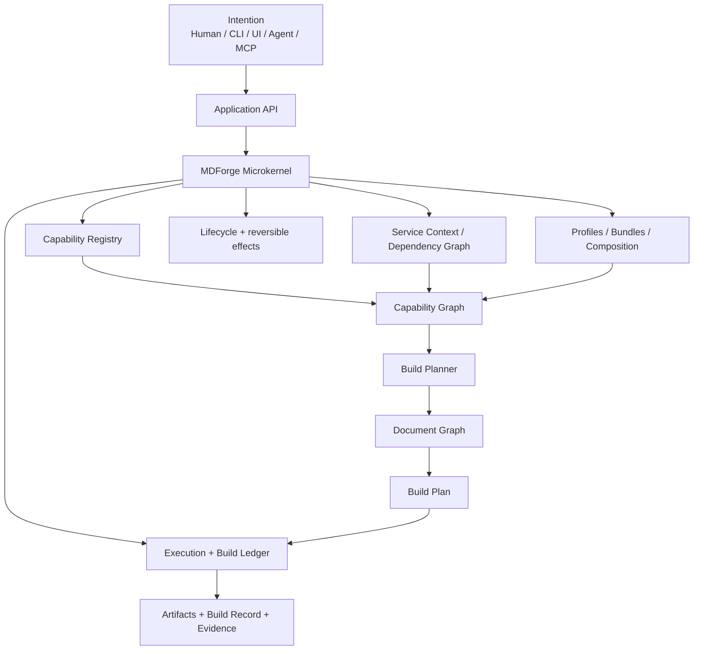

### 5.1 Constitution minimale du microkernel

Le kernel ne doit posséder **aucune connaissance directe** de :

```text
Markdown
DOCX / Word
PDF / HTML / LaTeX
WUST / IEEE / conventions de thèse
Pandoc / Mermaid / LaTeX engines
bibliographie particulière
GUI / TUI
MCP
```

Il possède uniquement les primitives nécessaires pour :

1. découvrir et identifier les capabilities ;
2. valider leurs contrats ;
3. résoudre leurs dépendances/services ;
4. monter et démonter leurs effets de façon réversible ;
5. composer des profiles/bundles ;
6. préparer une exécution déterministe ;
7. exécuter et produire un Build Record vérifiable.

Le **Build Planner** est une pièce motrice importante, mais il ne doit pas devenir un nouveau monolithe. Le kernel lui fournit le contexte et les contrats ; sa stratégie doit rester testable et remplaçable derrière une interface stable.

### 5.2 Principe constitutionnel — everything variable is a capability

Une fonctionnalité ne devient pas « core » parce qu'elle est importante.

Elle devient core uniquement si **aucun MDForge cohérent ne peut exister sans elle**.

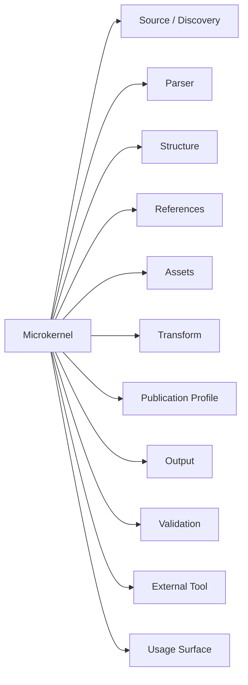

Ce principe s'inspire de l'idée « everything is a plugin » de DeepSeek Harness/Cordis, mais MDForge l'adapte au domaine documentaire et à ses contraintes de reproductibilité, de fichiers, d'outils externes et de publication.

### 5.3 Un plugin n'est pas nécessairement du Python

C'est une condition essentielle pour que MDForge puisse bénéficier de logiciels existants au lieu de les réécrire.

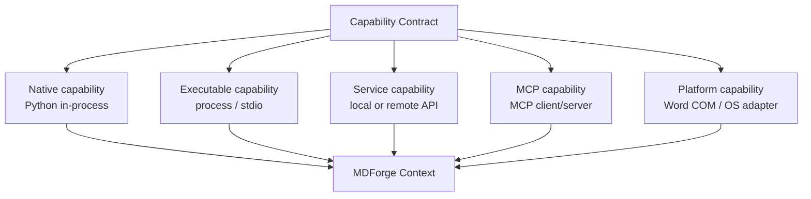

Conséquences :

- Pandoc peut être une executable capability ;
- Mermaid CLI peut être une executable capability ;
- Microsoft Word COM reste une platform capability Windows ;
- un moteur distant peut être une service capability ;
- un logiciel déjà MCP-native peut être raccordé par un MCP capability adapter ;
- un plugin léger de confiance peut vivre in-process sans coût d'isolation inutile.

**Local léger par défaut, isolation quand elle apporte une valeur réelle.**

### 5.4 Contrat minimum d'une capability

Chaque capability doit pouvoir déclarer au minimum :

```text
id
version
kind
provides[]
requires[]
optional_requires[]
platforms[]
configuration_schema
entrypoint
lifecycle
permissions / effects
```

Le registry produit un **graphe de services/capabilities**, jamais une liste opaque de modules.

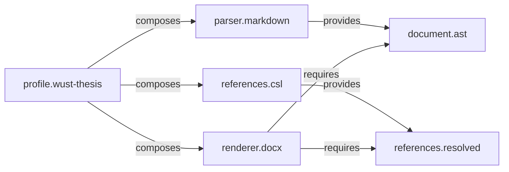

Les dépendances inter-capabilities passent par des contrats de services. Une capability ne doit pas importer les internals d'une autre capability comme API implicite.

### 5.5 Profiles / bundles — le produit comme composition

Un document publiable n'est pas un gros plugin.

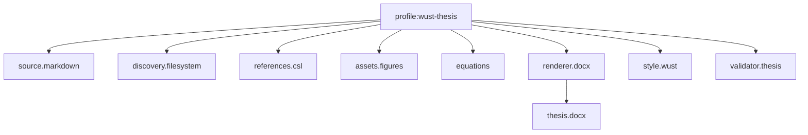

Un profile est une composition nommée, versionnée et surchargeable.

Exemples futurs :

```text
profile:wust-thesis
profile:ieee-article
profile:technical-report
profile:book
profile:web-documentation
```

Le profile décrit **ce qui est assemblé** ; il n'implémente pas lui-même toutes les capacités.

## 6. Baseline technologique candidate

Cette section fait sortir le projet des nuages sans transformer une technologie en dogme. Toute candidate doit passer par un prototype et des fitness functions avant d'être gelée par Target.

### 6.1 Runtime principal — Python 3.12+

**Python 3.12+** est la baseline candidate la plus cohérente :

- excellente lisibilité pour humains et agents IA ;
- écosystème documentaire mature ;
- compatibilité directe avec une grande partie des connaissances acquises via MDDOCX sans conserver son architecture ;
- SDK MCP officiel ;
- packaging/plugin discovery standards ;
- cross-platform Windows/Linux/macOS ;
- coût opérationnel faible.

Le domaine du kernel doit privilégier la bibliothèque standard :

```text
dataclasses
typing.Protocol
pathlib
graphlib
hashlib
importlib.metadata
```

`Pydantic` intervient surtout **aux frontières** : manifestes, configuration, protocoles externes, sérialisation et validation d'inputs. Le domaine interne ne doit pas en devenir dépendant sans nécessité.

### 6.2 Packaging et monorepo — uv workspace

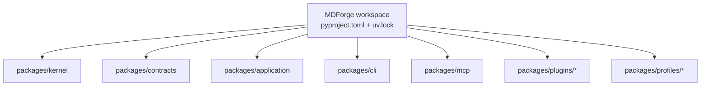

`uv workspace` est la baseline candidate pour :

- un lockfile commun ;
- des packages réellement séparés ;
- des dépendances explicites ;
- une installation rapide ;
- une granularité favorable aux agents parallèles.

### 6.3 Découverte de plugins — standards Python

La première couche de découverte doit utiliser les **Python package entry points** via `importlib.metadata.entry_points()`.

Exemple conceptuel :

```toml
[project.entry-points."mdforge.capabilities"]
markdown = "mdforge_markdown:plugin"
docx = "mdforge_docx:plugin"
```

Ainsi un plugin peut vivre :

```text
dans le monorepo
dans un repository séparé
sur un index Python
comme package installé explicitement par l'Operator
```

### 6.4 Hooks — pluggy comme candidate, pas comme kernel

`pluggy` est une candidate adaptée aux hooks 1→N et à la validation d'implémentations.

Mais :

> **un hook system n'est pas un plugin runtime complet.**

Le graphe de services, le lifecycle, la résolution des dépendances, l'isolation, les Build Plans et les permissions restent des responsabilités MDForge.

### 6.5 Concurrence — AnyIO

`AnyIO` est le candidat pour :

- concurrence structurée ;
- annulation ;
- orchestration async portable.

Les conversions lourdes CPU/processus restent explicitement exécutées comme subprocess ou workers. MDForge ne doit pas rendre l'ensemble du domaine async « par principe ».

### 6.6 CLI — Typer + Rich

Baseline candidate :

```text
Typer
+ Rich
```

Objectifs :

- commandes typées ;
- aide et completion automatiques ;
- diagnostics lisibles ;
- progress/status sans bruit ;
- sortie JSON structurée pour agents/automatisations.

Surface cible :

```text
mdforge build .
mdforge doctor
mdforge plugins
mdforge inspect
mdforge plan
mdforge explain last
```

### 6.7 HTTP local — FastAPI optionnel

Si une UI web ou une intégration HTTP locale est retenue, **FastAPI** est un candidat naturel comme adapter au-dessus de l'Application API.

FastAPI n'est pas requis pour :

```text
CLI
headless build
SDK Python
MCP stdio
```

Le produit doit rester utilisable sans serveur.

### 6.8 MCP — SDK Python officiel

MCP est un **adapter**, pas une seconde architecture.

Le SDK Python MCP officiel est la baseline candidate.

```text
MCP tool "build"
      ↓
Application API.build()
      ↓
same Build Plan
      ↓
same BuildRecord
```

CLI, UI et MCP doivent donc produire les mêmes effets applicatifs pour la même intention et la même configuration.

### 6.9 Qualité d'ingénierie

Baseline candidate :

```text
pytest
Ruff
type checking strict
contract tests
integration tests
acceptance fixtures
```

Les tests platform-specific (Word COM, OS adapters) doivent être séparés du corpus headless.

## 7. Topologie data minimale, locale et transparente

Le contenu utilisateur ne doit jamais disparaître dans une base opaque.

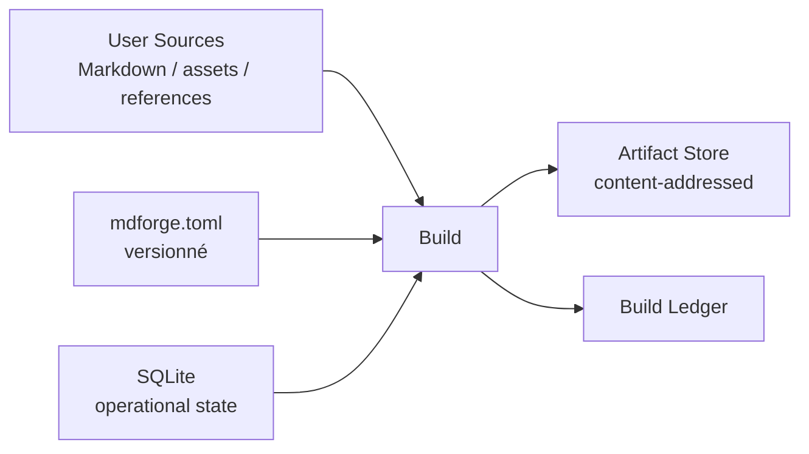

### 7.1 Sources et configuration canonique

Fichiers utilisateur + `mdforge.toml` :

- lisibles ;
- portables ;
- versionnables ;
- éditables sans outil propriétaire.

### 7.2 État opérationnel local

**SQLite** est la baseline candidate pour :

- catalogue/cache ;
- historique des builds ;
- état des plugins ;
- diagnostics ;
- index/fingerprints.

Avantages recherchés :

```text
embedded
transactional
zero-server
cross-platform
inspectable
backup simple
```

SQLite ne devient jamais la source de vérité des contenus auteurs.

### 7.3 Artifacts

Filesystem content-addressable store, adressé par SHA-256 :

```text
outputs
snapshots
intermediates utiles
evidence
```

Un Build Record référence les hashes au lieu de dupliquer le contenu.

### 7.4 Build reproductible

Un build doit pouvoir être décrit comme :

```text
Build =
    SourceSnapshot
  + ProjectConfiguration
  + ProfileComposition
  + CapabilityVersions
  + ToolchainFingerprint
  + BuildRequest
```

Résultat :

```text
BuildRecord
├── build_id
├── input_fingerprint
├── capability_graph
├── resolved_profile
├── toolchain
├── warnings/errors
├── output_artifacts
└── evidence
```

L'explicabilité n'est donc pas une fonction UI. C'est une propriété du backend.

## 8. Expectations produit

MDForge mature devrait permettre, sans réarchitecture, de satisfaire des intentions comme :

```text
« Voici ce dossier Markdown ; comprends sa structure. »
« Montre-moi comment tu comprends ce projet avant de faire quoi que ce soit. »
« Cette arborescence représente mes chapitres et sections ; mémorise cette lecture. »
« Forge-le comme thèse WUST en DOCX. »
« Forge le même contenu comme rapport interne. »
« Produit une candidate Word sans toucher au master. »
« Donne-moi HTML + PDF à partir du même graphe documentaire. »
« Explique pourquoi ce build échoue. »
« Quelles capabilities manquent pour cette recette ? »
« Recompile uniquement ce qui a changé. »
« Montre-moi exactement quelles sources ont produit cet artefact. »
« Installe ce renderer et utilise-le dans ce profile sans patcher le kernel. »
```

### Expectations constitutionnelles

1. **Composable** — des capacités peuvent être ajoutées/remplacées sans patcher le kernel.
2. **Contract-first** — version, compatibilité et limites d'un plugin sont explicites et testables.
3. **Project-aware** — la forge comprend un projet, pas seulement une liste de fichiers.
4. **Graph-aware** — structure, références, assets et relations deviennent un modèle explicite.
5. **Profile-aware** — conventions de publication séparées du renderer.
6. **Multi-output** — un même projet peut produire plusieurs artefacts.
7. **Reproductible** — inputs, config, versions, capabilities et artefacts sont traçables.
8. **Inspectable** — plan de build et diagnostics sont visibles avant/après exécution.
9. **Incremental-ready** — l'architecture ne doit pas empêcher cache, fingerprints et builds différentiels.
10. **Safe** — candidates/snapshots par défaut pour les artefacts autoritaires.
11. **Headless-first** — le cœur fonctionne sans GUI.
12. **Human + agent parity** — humains et agents passent par les mêmes cas d'usage applicatifs.
13. **Portable** — la logique documentaire ne doit pas être prisonnière de Windows/Word, même si certaines capabilities le sont.
14. **Observable** — erreurs structurées, événements et provenance plutôt que traces opaques.
15. **Testable in isolation** — contracts, fixtures et doubles permettent de tester une capability sans toute la forge.
16. **Local-first** — aucune infrastructure serveur ne doit être nécessaire pour le happy path.
17. **Externally extensible** — un logiciel existant peut être enveloppé comme capability au lieu d'être réécrit.
18. **Agent-parallel friendly** — deux capabilities indépendantes peuvent évoluer en parallèle sans conflit structurel récurrent.
19. **Progressive UX** — les conventions évidentes sont détectées et proposées ; la configuration explicite n'est demandée que lorsque l'ambiguïté ou l'intention utilisateur l'exige.
20. **Preview-first** — comprendre et confirmer la structure logique précède tout effet de compilation significatif.

## 9. Modèle mental du produit

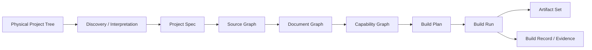

### Séparations essentielles

```text
arborescence physique       ≠ structure documentaire logique
fichiers physiques          ≠ unités documentaires
ordre des fichiers          ≠ structure logique
pattern détecté             ≠ pattern confirmé
profile                     ≠ capability
profil de publication       ≠ format de sortie
renderer                    ≠ post-processing
configuration utilisateur   ≠ état runtime
cache                       ≠ source de vérité
logs                        ≠ preuve structurée
MCP                         ≠ application core
plugin                      ≠ package Python obligatoire
```

## 10. Human-native, agent-native et UX par construction

L'objectif n'est pas de construire plusieurs produits.

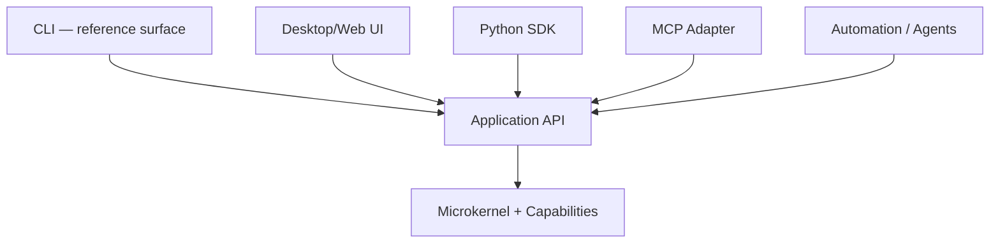

Aucune surface ne doit posséder de logique documentaire divergente.

### 10.1 Théorème UX — Discover → Understand → Confirm → Build

Le Target historique de Project Discovery révèle un cas d'usage fondamental : l'utilisateur arrive avec **un projet déjà organisé selon sa propre logique**, et attend de MDForge qu'il comprenne cette logique avant de lui demander de connaître les internals de la forge.

Le happy path cible est donc :

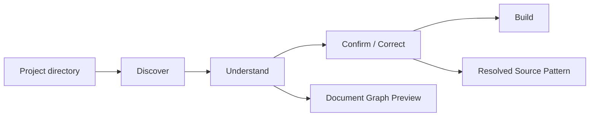

#### Discover

MDForge observe sans effet destructif :

```text
répertoires
fichiers Markdown
niveaux de titres
préfixes numériques
conventions d'ignorance
indices de chapitres / sections
patterns déjà enregistrés
```

La découverte est une **capability remplaçable**. Le kernel ne connaît aucune convention particulière de scan.

#### Understand

La forge transforme les observations en une ou plusieurs **interprétations candidates** :

```text
physical tree
→ inferred source pattern
→ source graph
→ document graph candidate
→ diagnostics + confidence + ambiguities
```

Elle ne confond jamais une convention détectée avec une vérité confirmée.

#### Confirm / Correct

Si la lecture est évidente, l'Operator peut l'accepter immédiatement. Si elle est ambiguë, MDForge présente **le minimum de choix nécessaire**, au lieu d'exiger un fichier de configuration complet.

L'utilisateur peut aussi imposer explicitement son propre `source-pattern` lorsque sa structure est particulière.

Doctrine :

> **convention-first, configuration-when-needed.**

Le système apprend ici la lecture du **projet**, pas une règle globale imposée à tous les projets.

#### Build

Un build significatif part d'un **Document Graph résolu et inspectable**. Si la structure change suffisamment pour invalider l'interprétation enregistrée, MDForge doit le signaler et revalider avant un effet autoritaire.

### 10.2 `mdforge inspect` comme porte d'entrée projet

`mdforge inspect <project>` n'est pas seulement une commande de debug. C'est la surface de compréhension fondamentale de MDForge.

Elle devrait pouvoir rendre :

```text
Project
├── inferred / configured source pattern
├── chapters
│   ├── sections
│   └── subsections
├── ignored sources
├── ambiguities
├── diagnostics
└── readiness
```

Une première expérience idéale doit pouvoir ressembler à :

```text
$ mdforge inspect .

Project understood with high confidence.

Chapters: 6
Sections: 24
Ignored sources: 3
Ambiguities: 1

Pattern inferred:
  directory -> chapter
  markdown file -> section
  ## heading -> subsection

Review ambiguity: Chapter 04 contains two files numbered 04_02.
```

Puis :

```text
mdforge inspect . --json
```

expose **la même vérité**, structurée pour un agent ou une automatisation.

### 10.3 Parité humain / agent dès la découverte

L'humain et l'agent ne disposent pas de deux moteurs de compréhension différents.

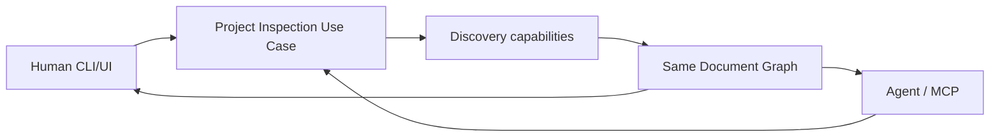

Un agent doit pouvoir :

```text
inspecter le projet
comprendre le pattern résolu
localiser une unité documentaire
voir les sources ignorées
lire les ambiguïtés
proposer une correction
faire confirmer une interprétation avant un build autoritaire
```

### CLI

La CLI sert de **surface de référence headless** :

```text
simple pour l'humain
stable pour les scripts
structurée pour les agents
```

Chaque commande importante doit avoir une sortie humaine et, quand pertinent, une sortie machine stable (`--json` ou équivalent).

La CLI doit privilégier une progression naturelle :

```text
mdforge inspect .
→ mdforge plan .
→ mdforge build .
```

plutôt que d'exposer d'abord la plomberie interne des capabilities.

### UI

L'UI doit être un client mince de l'Application API.

Elle pourra proposer :

```text
project cockpit
project structure preview
ambiguity resolver
capability/profile explorer
build plan preview
artifact browser
diagnostics/action center
visual comparison of builds
```

Sa technologie finale reste à choisir après prototype UX.

### MCP

Un agent doit pouvoir :

- inspecter un projet ;
- découvrir les capabilities disponibles ;
- lire et expliquer le Document Graph résolu ;
- voir les ambiguïtés avant exécution ;
- proposer ou fournir un source pattern ;
- obtenir un Build Plan sans exécuter ;
- lancer un build autorisé ;
- recevoir événements et diagnostics structurés ;
- localiser l'artefact et sa provenance ;
- comprendre les actions correctives sans parser une UI ou une traceback.

## 11. Topologie de repository favorable aux réseaux d'agents

Baseline candidate :

```text
Mdforge/
├── pyproject.toml
├── uv.lock
├── packages/
│   ├── kernel/
│   ├── contracts/
│   ├── application/
│   ├── cli/
│   ├── mcp/
│   ├── web/                 # seulement si retenu
│   ├── plugins/
│   │   ├── source-markdown/
│   │   ├── discovery-filesystem/
│   │   ├── source-pattern/
│   │   ├── parser-markdown/
│   │   ├── references-csl/
│   │   ├── renderer-docx/
│   │   ├── validator-core/
│   │   └── ...
│   └── profiles/
│       ├── wust-thesis/
│       └── ...
├── tests/
│   ├── contracts/
│   ├── integration/
│   └── acceptance/
└── _/agents/
```

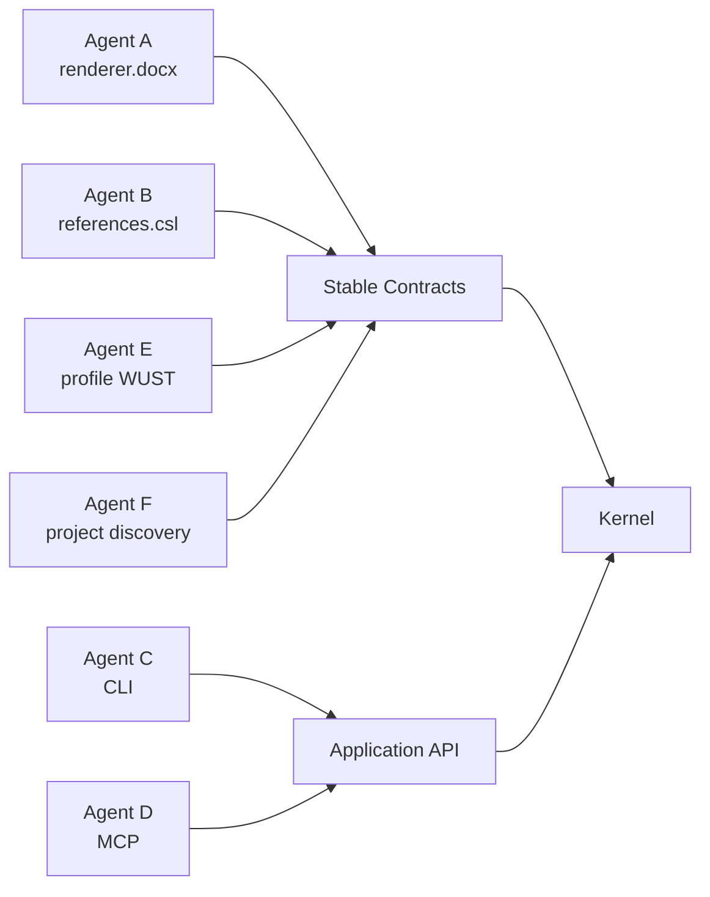

### Fitness functions agentiques

- aucune importation plugin→plugin par implémentation ;
- aucun renderer connu du kernel ;
- aucune convention de scan imposée par le kernel ;
- contract tests obligatoires par capability ;
- manifest valide ;
- dépendances résolubles ;
- même project + même pattern = même Document Graph ;
- sortie structurée stable ;
- installation/retrait d'une capability testés ;
- rollback lifecycle testé ;
- corpus headless séparé des tests platform-specific ;
- changement d'un plugin n'oblige pas à toucher le kernel sauf évolution explicite du contrat.

L'objectif est de réduire le **conflict surface area** pour les agents autant que la complexité logicielle.

## 12. Déploiement — léger par défaut

MDForge doit pouvoir être utile avec :

```text
un runtime local
+ les capabilities réellement nécessaires
+ zéro service obligatoire
```

### Happy path

```text
install
→ mdforge doctor
→ mdforge inspect .
→ mdforge build .
```

Aucun daemon, base distante ou orchestrateur externe ne doit être requis.

### Extensions possibles

```text
local HTTP adapter
desktop wrapper
remote build worker
daemon
shared artifact service
```

Ces extensions doivent être optionnelles et se brancher sur les mêmes contrats.

La distribution finale (package Python, standalone executable, desktop bundle) reste à comparer par Target.

## 13. Relation constitutionnelle avec MDDOCX — migration totale puis retrait

La cible n'est plus de préserver MDDOCX comme plugin géant.

MDDOCX doit être traité comme :

```text
laboratoire historique de besoins
+ oracle de comportements
+ collection de cas limites / fixtures
+ source d'exigences DOCX/Word
≠ architecture à conserver
≠ dependency permanente
≠ capability monolithique finale
```

### Stratégie cible

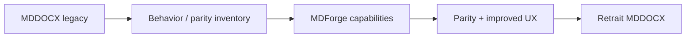

Principes :

1. caractériser les comportements utiles avant remplacement ;
2. reclasser chaque fonction utile dans la capability correcte ;
3. ne pas déplacer mécaniquement l'architecture hexagonale existante ;
4. préserver les fixtures et cas limites utiles ;
5. prouver parité fonctionnelle + meilleure UX ;
6. retirer le submodule et les voies MDDOCX quand aucune autorité active n'en dépend ;
7. archiver les preuves de migration selon les règles TAKOUDJOU.

Les particularités Word pourront survivre sous forme de capabilities dédiées (`renderer.docx`, `platform.word-com`, etc.), mais **MDDOCX comme produit autonome est destiné à disparaître** si la migration atteint sa preuve de parité.

## 14. Topologies encore ouvertes

Le Memory Diagram choisit maintenant une **baseline technologique crédible**, mais laisse volontairement ouvertes les décisions qui nécessitent prototype ou benchmark.

| Axe | Baseline / question restante |
|---|---|
| **Kernel** | Python 3.12+ ; préciser la frontière exacte kernel/application/planner |
| **Plugin runtime** | entry points + in-process par défaut ; définir isolation subprocess/service et lifecycle |
| **Project Discovery** | conventions inférées + source-pattern explicite ; préciser scoring/confidence, ambiguïtés et persistance de la confirmation |
| **Hooks** | évaluer `pluggy` uniquement là où les hooks apportent une vraie valeur |
| **Frontend** | CLI référence ; comparer desktop native, web local et wrapper hybride |
| **Data** | SQLite + filesystem CAS ; définir schema, GC, migrations et layering |
| **Configuration** | `mdforge.toml` ; préciser profiles, source patterns, overrides locaux, secrets et portable paths |
| **MCP** | SDK officiel ; préciser tools/resources, streaming, permissions et long-running builds |
| **Distribution** | `uv`/package Python comme dev baseline ; comparer standalone executable/desktop bundle |
| **Security** | définir trust model, filesystem/network/process scopes et sandbox des plugins externes |
| **Cross-language** | définir si/à quel moment un wire protocol stable devient nécessaire |
| **Workers distants** | hors happy path ; seulement si les workloads le justifient |

Les choix définitifs doivent être arbitrés par :

```text
expectations
+ prototype
+ benchmark
+ fitness functions
+ coût de maintenance
+ expérience Operator
+ expérience agent
```

## 15. Frontières de responsabilité cibles

```text
MDForge Microkernel
  possède discovery de capabilities, contracts, service context, lifecycle, composition primitives

Application Core
  possède les cas d'usage et orchestration métier générique

Project Discovery
  observe une arborescence, produit des interprétations candidates et diagnostics via capabilities remplaçables

Source Pattern
  décrit explicitement ou matérialise après confirmation la lecture d'un projet

Build Planner
  résout un projet + capability graph en Build Plan inspectable

Project Model
  possède l'intention documentaire déclarative et la lecture confirmée du projet

Document Graph
  possède la structure documentaire logique indépendante du layout physique

Capabilities
  possèdent le traitement spécialisé

Profiles / Bundles
  composent des capabilities et de la configuration

Renderers
  matérialisent un format

Build Ledger
  possède Build Records, provenance et evidence references

Surfaces
  possèdent interaction, jamais les règles métier centrales

MCP
  possède traduction protocolaire agent ↔ Application API
```

## 16. Familles de Targets qui doivent naître de cette carte

Ce sont des frontières de futurs programmes, pas encore leurs plans d'implémentation :

1. **Foundation & Microkernel Contracts** — capability contract, registry, service context, lifecycle, errors/events.
2. **Project Discovery & Document Graph** — project spec, conventions, source-pattern, discovery, diagnostics, source/document model, références/assets.
3. **Plugin Runtime & Composition** — entry points, manifests, dependency resolution, profiles/bundles, isolation.
4. **Build Engine & Evidence** — planner, execution, incremental/cache strategy, build record, artifact store, diagnostics.
5. **Human Experience** — inspect-first onboarding, CLI référence puis meilleure surface interactive, preview et ergonomie projet.
6. **Agent/MCP Surface** — discovery, inspection, correction, planning, build, diagnostics, permissions et long-running work.
7. **Legacy Extraction & MDDOCX Retirement** — inventory, fixtures, parity, migration, retrait du submodule.

Ces familles pourront être fusionnées ou scindées après les exercices de topologie. Le présent diagramme ne fixe pas leur nombre final.

## 17. Invariants constitutionnels

1. Le kernel reste petit ; une exception demande une justification architecturale.
2. Tout ce qui varie par type de document, format, outil externe ou workflow est candidat à une capability.
3. Une capability peut être native, exécutable, service, MCP ou platform adapter ; « plugin » n'implique pas Python.
4. Un plugin ne lit pas les internals d'un autre plugin comme API implicite.
5. Les contrats partagés sont versionnés et testables.
6. Publication Profile et Output Renderer restent orthogonaux.
7. Le modèle documentaire interne ne dépend pas des noms de dossiers.
8. Les effets filesystem/process/network sont gouvernés par des ports/adapters identifiables.
9. Un build peut être planifié et inspecté avant exécution.
10. Les surfaces UI/CLI/MCP n'embarquent pas de logique métier divergente.
11. L'écrasement d'un artefact autoritaire est explicite, jamais le défaut.
12. L'état dérivé/cache est reconstructible ; l'input autoritaire est identifiable.
13. Une capability optionnelle peut être absente sans rendre le kernel inutilisable.
14. Une panne de plugin produit un diagnostic borné et attribuable.
15. Le happy path reste local-first et sans serveur obligatoire.
16. Une capability significative peut être ajoutée sans patcher le kernel.
17. La modularité est mesurée par les frontières et remplaçabilités réellement testées, pas par le nombre de dossiers `modules/`.
18. MDDOCX est une source de migration temporaire, pas une dépendance architecturale permanente.
19. Les frontières du repository doivent permettre le travail parallèle d'agents sans conflits structurels récurrents.
20. Un choix technologique n'est gelé qu'après prototype et preuve adaptée.
21. **Physical tree ≠ logical document graph** : l'arborescence source est une observation, jamais le modèle documentaire final.
22. **Convention-first / configuration-when-needed** : MDForge propose une lecture quand elle peut être déduite avec confiance ; il demande ou accepte une configuration explicite lorsque nécessaire.
23. **Preview-before-effects** : la structure logique, les ambiguïtés et diagnostics sont inspectables avant un build à effets significatifs.
24. **Human/agent parity from discovery** : humain et agent consomment le même Project Inspection Use Case, le même Document Graph et les mêmes diagnostics.

## 18. Test du théorème

Le théorème est réellement implémenté lorsqu'une nouvelle capacité significative peut être ajoutée sans modifier le kernel.

```text
Given:
  MDForge installé et fonctionnel

When:
  un nouveau renderer / parser / validator / source provider est installé

Then:
  il est découvert,
  son contrat est validé,
  ses dépendances sont résolues,
  il apparaît dans le capability graph,
  un profile peut le composer,
  CLI/UI/MCP peuvent l'utiliser via l'Application API,
  un Build Record permet d'expliquer l'exécution,
  et son retrait restaure proprement l'état précédent

Without:
  patcher le kernel.
```

Cette propriété — et non le nombre de formats déjà supportés — prouve que MDForge est réellement devenu une forge modulaire.

Le théorème UX doit également tenir :

```text
Given:
  un répertoire Markdown cohérent mais encore inconnu de MDForge

When:
  humain ou agent demande son inspection

Then:
  MDForge propose une interprétation déterministe,
  expose le Document Graph candidat,
  signale ignorés et ambiguïtés,
  permet confirmation ou correction,
  et n'exige une configuration détaillée que si elle apporte réellement de l'information

Without:
  compiler pour découvrir la structure,
  imposer une convention globale,
  ou produire deux vérités différentes pour humain et agent.
```

## 19. Contrôle avant toute mission d'implémentation

Avant de rédiger un premier Target de code, répondre explicitement :

```text
1. Quelle expectation produit cette cible sert-elle ?
2. Quelle frontière devient stable après cette cible ?
3. Qu'est-ce qui doit rester remplaçable ?
4. Quel contrat peut être gelé sans choisir trop tôt la topologie ?
5. Quelle partie de MDDOCX est seulement caractérisée puis migrée ?
6. Quelle preuve démontrera la modularité réelle ?
7. Le chemin humain et le chemin agent consomment-ils la même Application API ?
8. L'état et les artefacts produits sont-ils traçables et reconstructibles ?
9. Le changement peut-il être développé/testé par un agent sans toucher des modules indépendants ?
10. Le choix technologique est-il justifié par prototype/benchmark ou seulement par préférence ?
11. L'Operator doit-il réellement configurer cette information ou MDForge peut-il la détecter/proposer ?
12. L'interprétation produite est-elle inspectable et corrigeable avant effets ?
13. Humain et agent voient-ils exactement la même compréhension structurée du projet ?
```

Si une cible force plusieurs topologies non encore prouvées en même temps, elle est trop couplée et doit être redécoupée.

## 20. Cycle de vie

Ce diagramme reste actif tant qu'il gouverne l'architecture de MDForge. Les futurs Targets le référencent dans `source_context`.

Une évolution majeure produit une nouvelle version avec `supersedes` et met à jour les références dans le même commit. Il n'est archivé que lorsqu'aucun Target, skill ou document actif n'en dépend.

## 21. Résultat mental final

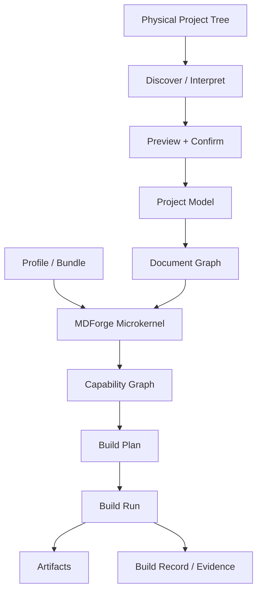

```text
Kernel        = composition substrate
Capabilities  = puzzle pieces
Discovery     = physical tree → candidate understanding
Source Pattern= explicit or confirmed project-reading contract
DocumentGraph = logical document truth used downstream
Profiles      = named compositions
Application   = common use cases
CLI/UI/MCP    = adapters over the same understanding
SQLite/CAS    = lightweight operational substrate
MDDOCX        = temporary migration oracle, then retired
```

> **MDForge doit rendre facile l'ajout d'un nouveau fil documentaire ou d'un logiciel existant sans obliger à redessiner la forge — et rendre naturel le fait de lui confier un projet sans obliger l'utilisateur à penser comme son moteur interne.**
