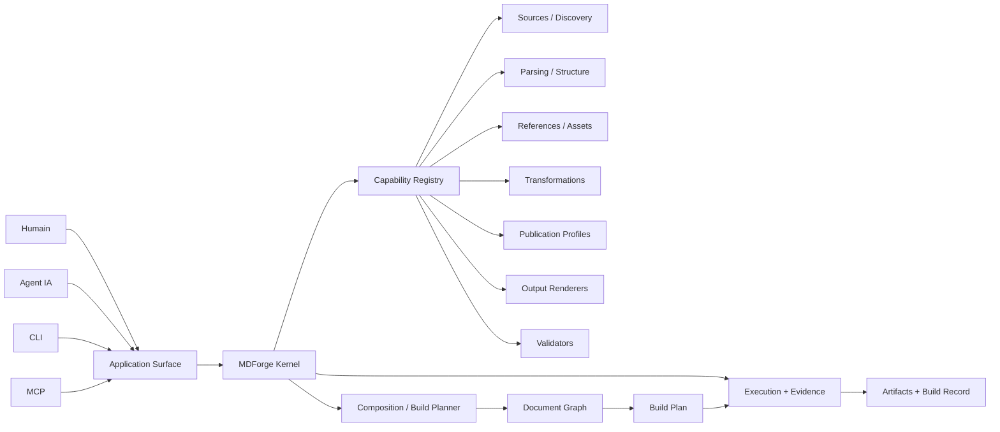
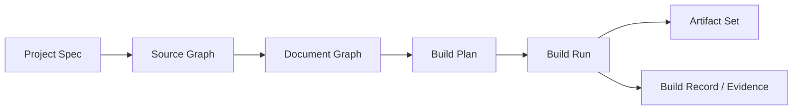
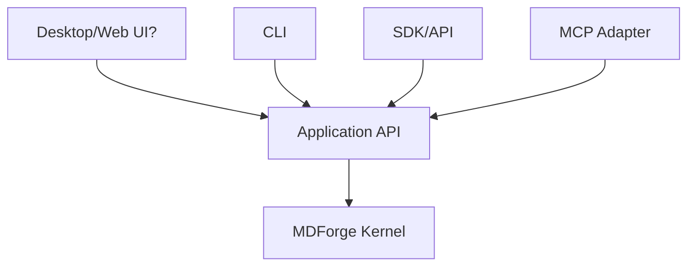
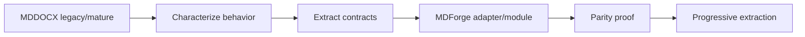

# Memory Diagram — MDForge, forge documentaire modulaire et agent-native

## 1. Portée et niveau de vérité

Ce document fixe **l'architecture cible de réflexion** pour repenser MDForge avant de choisir sa topologie backend, frontend, data ou MCP.

Il ne prétend pas que cette architecture est implémentée.

### Vérité observée au baseline

Au SHA MDForge `a9023cc5efc96314d6590ed17e5fabe3bb6fdd61` :

- le repository est une coquille MDForge minimale ;
- `launch_mdforge.bat` délègue encore au sous-projet MDDOCX ;
- `Mddocx/` est un submodule au SHA `92095562b1d9b421c3c5cc7f761c16b74115c5a7` ;
- le manifest identifie déjà le produit comme `infrastructure:mdforge`.

Tout le reste de ce document est **architecture_target** : expectations, frontières et hypothèses de conception à transformer plus tard en Targets.

```text
OBSERVÉ
MDForge shell → MDDOCX

CIBLE
MDForge = forge composable
MDDOCX = une capacité de cette forge
```

## 2. Sources de vérité et ordre de lecture

```text
AGENTS.md
→ manifest.yaml
→ _/agents/INDEX.md
→ contrat Memory Diagrams
→ CE diagramme
→ futur(s) Target(s)
→ code / tests au SHA de mission
```

Quand le repository est monté dans TAKOUDJOU, les contrats institutionnels de Researches gouvernent la coordination et PACTE ; MDForge ne les recopie pas.

## 3. Préséance

```text
Architecture future
  ce Memory Diagram
  > Targets dérivés
  > artefacts de mission

Existence réelle
  preuve reproductible
  > code/contrats au SHA chargé
  > documentation
```

Une API imaginée ici n'existe pas tant qu'un Target ne l'a pas livrée et prouvée.

## 4. Vocabulaire égalisé

| Terme | Sens architectural |
|---|---|
| **Forge** | système qui transforme un projet documentaire en artefacts traçables selon une composition de capacités |
| **Kernel** | noyau minimal qui connaît contrats, cycle de vie, composition, exécution et preuve — pas les formats métier particuliers |
| **Capability / Plugin** | unité remplaçable ou composable apportant une capacité documentaire |
| **Project** | contexte d'une production : sources, configuration, profils, assets, références, politiques et outputs attendus |
| **Document Graph** | représentation structurée du contenu et de ses relations, indépendante du simple layout de fichiers |
| **Publication Profile** | conventions d'un produit documentaire : thèse, article, rapport, livre, etc. |
| **Renderer / Output Module** | capacité qui matérialise un artefact : DOCX, PDF, HTML, EPUB, LaTeX, etc. |
| **Pipeline / Recipe** | composition explicite de capacités pour un build donné |
| **Build Plan** | plan résolu avant effets : capacités, ordre, inputs, outputs, diagnostics attendus |
| **Build Record** | trace reproductible du build réellement exécuté |
| **Artifact** | sortie produite : document, rapport, manifeste, preview, logs structurés, etc. |
| **Agent Surface** | interface structurée permettant à un agent d'inspecter, planifier, compiler et diagnostiquer |

Ces termes sont conceptuels. Ils ne prescrivent encore ni langage, ni classes, ni processus, ni framework.

## 5. Théorème de conception

> **MDForge n'est pas un convertisseur Markdown→X. C'est un moteur de composition de capacités documentaires dont Markdown est le substrat d'auteur natif.**



Le kernel connaît **comment composer et gouverner** ; les plugins connaissent **comment traiter un domaine particulier**.

## 6. Modularité par principe

La modularité n'est pas une fonctionnalité ajoutée après coup. Elle est une règle constitutionnelle.

### Le kernel peut posséder

- contrats et identités de capabilities ;
- enregistrement/découverte contrôlée ;
- résolution des dépendances et compatibilités ;
- composition d'un pipeline ;
- cycle de vie des capabilities ;
- planification avant effets ;
- exécution gouvernée ;
- événements, diagnostics, provenance et preuves ;
- politique de sécurité/sandbox si nécessaire.

### Le kernel ne doit pas posséder directement

- conventions WUST ;
- styles DOCX ;
- logique Pandoc particulière ;
- syntaxe bibliographique spécifique ;
- stratégie de scan d'un projet imposée à tous ;
- HTML/PDF/EPUB/LaTeX particuliers ;
- logique GUI ;
- protocole MCP lui-même.

### Familles de capabilities possibles

```text
source / discovery
parser
structure resolver
reference provider
asset provider
transformer
publication profile
renderer / output module
post-processor
validator
previewer
exporter
agent adapter
```

Une famille n'implique pas nécessairement un package ou un processus séparé. La topologie technique reste à décider.

## 7. Expectations produit

MDForge mature devrait permettre, sans réarchitecture, de satisfaire des intentions comme :

```text
« Voici ce dossier Markdown ; comprends sa structure. »
« Forge-le comme thèse WUST en DOCX. »
« Forge le même contenu comme rapport interne. »
« Produit une candidate Word sans toucher au master. »
« Donne-moi HTML + PDF à partir du même graphe documentaire. »
« Explique pourquoi ce build échoue. »
« Quelles capabilities manquent pour cette recette ? »
« Recompile uniquement ce qui a changé. »
« Montre-moi exactement quelles sources ont produit cet artefact. »
```

### Expectations constitutionnelles

1. **Composable** — des capacités peuvent être ajoutées/remplacées sans patcher le kernel.
2. **Contract-first** — version, compatibilité et limites d'un plugin sont explicites et testables.
3. **Project-aware** — la forge comprend un projet, pas seulement une liste de fichiers.
4. **Graph-aware** — structure, références, assets et relations deviennent un modèle explicite.
5. **Profile-aware** — conventions de publication séparées du renderer.
6. **Multi-output** — un même projet peut produire plusieurs artefacts.
7. **Reproductible** — inputs, config, versions, capabilities et artefacts sont traçables.
8. **Inspectable** — plan de build et diagnostics sont visibles avant/après exécution.
9. **Incremental-ready** — l'architecture ne doit pas empêcher cache, fingerprints et builds différentiels.
10. **Safe** — candidates/snapshots par défaut pour les artefacts autoritaires.
11. **Headless-first** — le cœur fonctionne sans GUI.
12. **Human + agent parity** — humains et agents passent par les mêmes cas d'usage applicatifs.
13. **Portable** — la logique documentaire ne doit pas être prisonnière de Windows/Word, même si certaines capabilities le sont.
14. **Observable** — erreurs structurées, événements et provenance plutôt que traces opaques.
15. **Testable in isolation** — contracts, fixtures et doubles permettent de tester une capability sans toute la forge.

## 8. Modèle mental du produit

Le chemin conceptuel recherché est :



### Séparations essentielles

```text
fichiers physiques          ≠ unités documentaires
ordre des fichiers          ≠ structure logique
profil de publication       ≠ format de sortie
renderer                    ≠ post-processing
configuration utilisateur   ≠ état runtime
cache                       ≠ source de vérité
logs                        ≠ preuve structurée
MCP                         ≠ application core
```

## 9. Human-native et agent-native

L'objectif n'est pas de construire deux produits.



Les surfaces peuvent différer dans leur ergonomie, mais ne doivent pas réimplémenter les règles métier.

Un agent doit pouvoir au minimum :

- inspecter un projet ;
- découvrir les capabilities disponibles ;
- obtenir un Build Plan sans exécuter ;
- lancer un build autorisé ;
- recevoir événements et diagnostics structurés ;
- localiser l'artefact et sa provenance ;
- comprendre les actions correctives sans parser une UI ou une traceback.

## 10. Topologies à explorer — décisions volontairement ouvertes

Ce Memory Diagram **ne choisit pas encore** ces solutions. Elles feront l'objet de réflexion/recherche puis de Targets distincts.

| Axe | Questions à résoudre |
|---|---|
| **Backend** | modular monolith ou plugin runtime plus isolé ? chargement in-process, subprocess ou mixte ? contrats synchrones/async ? dependency graph ? sandbox ? |
| **Plugin system** | manifestes, discovery, semver/capability negotiation, isolation des pannes, hot/reload ou résolution au démarrage ? |
| **Frontend** | CLI comme référence ? desktop native, web local, hybride ? preview ? project cockpit ? comment garder l'UI mince ? |
| **Data** | où vivent Project Spec, graph, caches, build records, indexes, artifacts ? quels éléments sont déclaratifs, dérivés ou éphémères ? |
| **Configuration** | manifests projet, profiles, overrides locaux, secrets, portable paths, layering ? |
| **MCP** | quels tools/resources/prompts ? streaming d'événements ? permission model ? MCP comme adapter externe au core ? |
| **Distribution** | package Python, executable, service local, daemon optionnel ? gestion des dépendances externes lourdes ? |
| **Security** | plugins non fiables ? exécution de converters ? filesystem/network scopes ? |
| **Compatibility** | comment absorber MDDOCX sans casser son corridor Word mature ? |

Le futur Code Engineering devra comparer les solutions par rapport aux **expectations**, pas choisir une technologie par préférence.

## 11. Relation constitutionnelle avec MDDOCX

MDDOCX doit être traité comme :

```text
capacité de production réelle et mature
+ laboratoire historique de besoins
+ source de comportements à préserver
≠ architecture imposée à MDForge
```

### Stratégie conceptuelle de migration



Principes :

1. pas de big-bang rewrite ;
2. caractériser les comportements utiles avant extraction ;
3. extraire d'abord les contrats et frontières, pas déplacer des fichiers mécaniquement ;
4. maintenir une voie compatible jusqu'à preuve de parité ;
5. les particularités Word restent dans la capability DOCX/MDDOCX ;
6. les primitives génériques découvertes dans MDDOCX peuvent être promues dans MDForge seulement après preuve qu'elles sont réellement génériques.

## 12. Frontières de responsabilité cibles

```text
MDForge Kernel
  possède composition, lifecycle, planification, exécution, preuve

Project Model
  possède intention documentaire déclarative et graphe résolu

Capabilities
  possèdent traitement spécialisé

Publication Profiles
  possèdent conventions de produit documentaire

Renderers
  possèdent matérialisation d'un format

Surfaces
  possèdent interaction, jamais règles métier centrales

MCP
  possède traduction protocolaire agent ↔ application API

MDDOCX
  possède le corridor spécialisé DOCX/Word tant qu'il en est l'owner réel
```

## 13. Familles de Targets qui doivent naître de cette carte

Ce sont des **frontières de futurs programmes**, pas encore des plans d'implémentation :

1. **Foundation & Kernel Contracts** — objet de composition, capability contract, lifecycle, errors/events.
2. **Project & Document Graph** — discovery, project spec, source/document model, références/assets.
3. **Plugin Runtime & Composition** — registry, manifests, dependency resolution, compatibility, isolation.
4. **Build Engine & Evidence** — plan, execution, incremental/cache strategy, build record, diagnostics.
5. **Human Experience** — CLI puis meilleure surface interactive, preview et ergonomie projet.
6. **Agent/MCP Surface** — discovery, inspection, planning, build, diagnostics et permission model.
7. **MDDOCX Integration/Migration** — adapter, parité, extraction progressive des primitives génériques.

Ces familles pourront être fusionnées ou scindées après l'exercice de topologie. Le présent diagramme ne fixe pas leur nombre final.

## 14. Invariants constitutionnels

1. Le kernel reste petit ; une exception demande une justification architecturale.
2. Tout ce qui varie par type de document, format, outil externe ou workflow est candidat à une capability.
3. Un plugin ne lit pas les internals d'un autre plugin comme API implicite.
4. Les contrats partagés sont versionnés et testables.
5. Publication Profile et Output Renderer restent orthogonaux.
6. Le modèle documentaire interne ne dépend pas des noms de dossiers.
7. Les effets filesystem/process/network sont gouvernés par des ports/adapters identifiables.
8. Une build peut être planifiée/inspectée avant exécution.
9. Les surfaces UI/CLI/MCP n'embarquent pas de logique métier divergente.
10. L'écrasement d'un artefact autoritaire est explicite, jamais le défaut.
11. L'état dérivé/cache est reconstructible ; l'input autoritaire est identifiable.
12. Une capability optionnelle peut être absente sans rendre le kernel inutilisable.
13. Une panne de plugin doit produire un diagnostic borné et attribuable.
14. MDDOCX est intégré par caractérisation/parité, pas par réécriture aveugle.
15. La modularité est mesurée par les frontières et remplaçabilités réellement testées, pas par le nombre de dossiers `modules/`.

## 15. Contrôle avant toute mission d'implémentation

Avant de rédiger un premier Target de code, répondre explicitement :

```text
1. Quelle expectation produit cette cible sert-elle ?
2. Quelle frontière devient stable après cette cible ?
3. Qu'est-ce qui doit rester remplaçable ?
4. Quel contrat peut être gelé sans choisir trop tôt la topologie ?
5. Quelle partie de MDDOCX est observée, réutilisée, adaptée ou laissée intacte ?
6. Quelle preuve démontrera la modularité réelle ?
7. Le chemin humain et le chemin agent consomment-ils le même Application API ?
8. L'état et les artefacts produits sont-ils traçables et reconstructibles ?
```

Si la réponse exige de choisir prématurément backend/frontend/data/MCP, la cible est trop couplée et doit être redécoupée.

## 16. Cycle de vie

Ce diagramme reste actif tant qu'il gouverne l'architecture de MDForge. Les futurs Targets le référencent dans `source_context`.

Une évolution majeure produit une nouvelle version avec `supersedes` et met à jour les références dans le même commit. Il n'est archivé que lorsqu'aucun Target, skill ou document actif n'en dépend.

## 17. Résultat mental final

```text
Markdown
   ↓
Project / Document Graph
   ↓
MDForge Kernel
   ↓ compose
Capabilities
   ↓
Build Plan → Build Run → Artifacts + Evidence

MDDOCX = capability historique DOCX/Word
CLI/UI/MCP = surfaces d'un même système applicatif
```

> **MDForge doit rendre facile l'ajout d'un nouveau fil documentaire sans obliger à redessiner la forge.**
