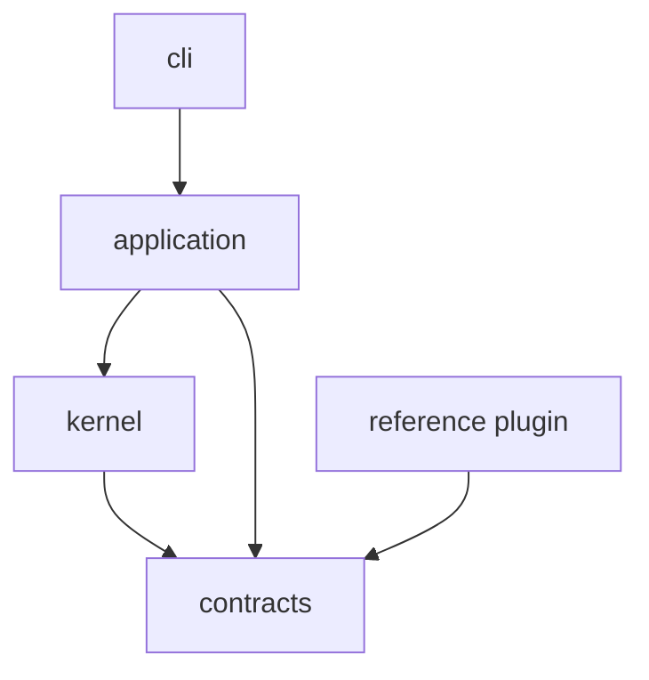
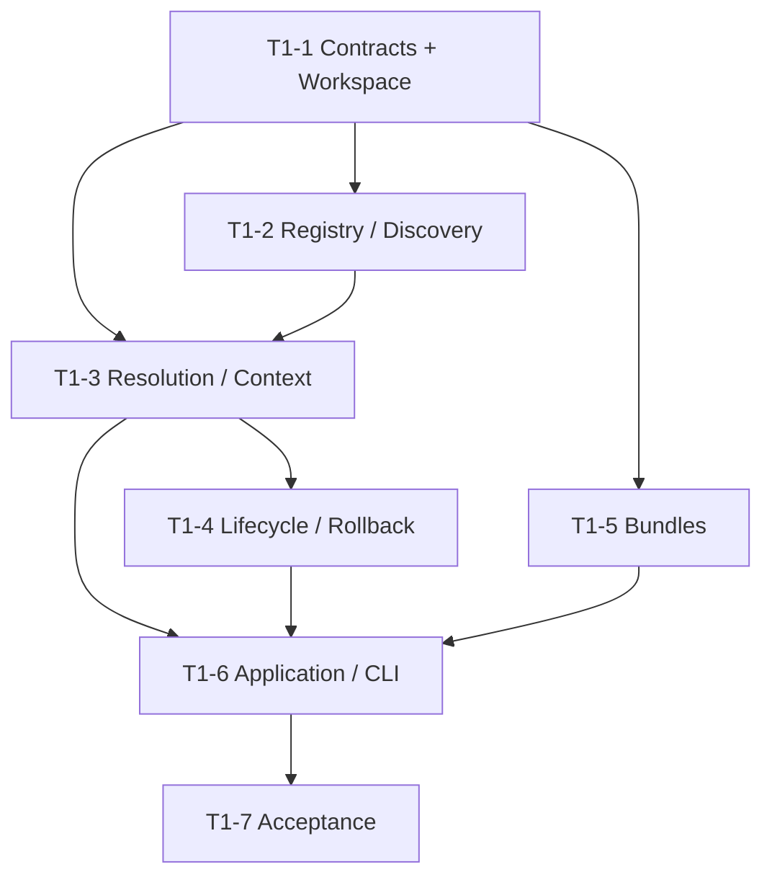

# Target — MDForge Foundation, Microkernel Contracts & Capability Runtime

> **Promesse** : à la clôture de ce Target, MDForge possède un noyau minimal, testable et réellement exécutable capable de **découvrir, valider, résoudre, activer, composer, inspecter et démonter des capabilities** derrière des contrats stables, sans connaissance de Markdown, DOCX, thèse, publication profile ou workflow documentaire particulier.

Ce Target ne cherche pas encore à rendre MDForge utile comme forge documentaire complète. Il construit le **substrat constitutionnel** sur lequel T2 pourra apprendre à comprendre un projet et T3 pourra livrer une expérience humaine chaleureuse et pratiquement utilisable.

Le critère de réussite n'est donc pas « beaucoup de fonctionnalités ». C'est :

```text
une nouvelle capability native
peut être ajoutée
→ découverte
→ validée
→ résolue
→ activée
→ consommée par contrat
→ inspectée
→ arrêtée proprement

sans patcher le kernel.
```

---

## 1. Pourquoi cette cible existe

Le Memory Diagram fixe un théorème de conception :

> **everything variable is a capability**.

Ce principe n'a de valeur que si le runtime qui le rend possible est petit, déterministe, réversible et suffisamment stable pour accueillir des capabilities développées en parallèle par plusieurs agents.

T1 doit donc établir cinq réalités avant toute logique documentaire :

1. une **identité de capability** et des contrats versionnés ;
2. une **découverte standard** qui n'impose pas l'implémentation au kernel ;
3. un **Capability Registry + Service Context** capables de résoudre les dépendances ;
4. un **lifecycle transactionnel et réversible** ;
5. une **Application Runtime API** unique que les futures surfaces CLI/UI/MCP pourront consommer.

La cible doit résister à deux échecs symétriques :

```text
Échec A
kernel trop pauvre
→ chaque feature invente son propre runtime
→ couplage et incohérences

Échec B
kernel trop intelligent
→ le domaine documentaire fuit dans le core
→ nouveau monolithe
```

T1 doit rester exactement au milieu : **minimal mais suffisant**.

---

## 2. Résultat attendu après T1

Après ce Target, le repository doit pouvoir démontrer, sur une installation propre :

```text
uv sync
uv run mdforge doctor
uv run mdforge capabilities
uv run pytest
```

et prouver un scénario runtime complet :


### Après T1, MDForge sait

- démarrer un runtime vide ;
- découvrir les capabilities natives installées ;
- lire et valider leurs manifests ;
- identifier les services qu'elles `provide` et `require` ;
- détecter doublons, cycles, dépendances absentes et versions incompatibles ;
- construire un graphe déterministe ;
- sélectionner un provider sans ambiguïté ou refuser explicitement ;
- activer les capabilities dans l'ordre topologique ;
- injecter les dépendances par contrats ;
- annuler proprement une activation partielle en cas d'échec ;
- arrêter en ordre inverse ;
- produire erreurs, diagnostics et événements structurés ;
- inspecter le runtime avec une surface CLI minimale ;
- composer un bundle runtime minimal sans connaissance documentaire.

### Après T1, MDForge ne sait pas encore

- comprendre un répertoire Markdown ;
- produire un Source Graph ou Document Graph ;
- inférer un `source-pattern` ;
- appliquer un Publication Profile ;
- planifier ou exécuter un build documentaire ;
- produire DOCX/PDF/HTML ;
- offrir la Workbench UI de T3 ;
- gérer un artifact ledger, cache ou build incrémental ;
- exécuter universellement des plugins subprocess/service/MCP ;
- exposer son application par MCP ;
- remplacer MDDOCX.

Ces absences sont **des frontières**, pas des manques de T1.

---

## 3. Décisions constitutionnelles que T1 doit matérialiser

### 3.1 Le kernel ne connaît aucun domaine documentaire

Aucun symbole du kernel ne doit contenir une dépendance sémantique vers :

```text
markdown
chapter
section
thesis
citation
docx
word
pdf
wust
renderer
publication
```

Les termes génériques `capability`, `service`, `profile/bundle`, `runtime`, `effect`, `event`, `contract` sont admis.

### 3.2 Contracts before implementations

Les contrats communs précèdent leurs consommateurs. Les agents ne développent pas simultanément plusieurs implémentations autour d'une interface encore mouvante.

Ordre obligatoire :

```text
contracts
→ contract tests
→ runtime implementations
→ reference capabilities
→ consumers
```

### 3.3 Pas de service locator opaque

Une capability reçoit un contexte borné qui expose seulement ses dépendances résolues et les services runtime autorisés.

Interdit :

```text
global singleton
arbitrary import into another plugin
untyped dict of everything
ambient mutable state
```

### 3.4 Lifecycle réversible

Une activation est une transaction logique :

```text
resolve
→ prepare
→ start capability A
→ start capability B
→ B fails
→ stop A
→ runtime returns to a known state
```

Le rollback de ce Target concerne le **runtime activation state**, pas encore les effets documentaires futurs.

### 3.5 Determinism first

Même ensemble de capabilities + mêmes versions + même composition = même graphe résolu et même ordre d'activation.

Toute ambiguïté de provider doit être :

```text
explicitly resolved
OR
explicitly rejected
```

jamais arbitrée silencieusement selon l'ordre du filesystem/import.

---

## 4. Baseline technologique de T1

T1 concrétise la baseline candidate du Memory Diagram, mais uniquement là où elle sert directement la fondation.

### Retenu pour T1

```text
Python >= 3.12
uv workspace + uv.lock
typing.Protocol / dataclasses
importlib.metadata entry points
packaging.version / SpecifierSet
Pydantic aux frontières manifest/config seulement
pytest
Ruff
strict type checking
Typer + Rich pour la CLI diagnostique minimale
```

### À évaluer pendant T1

`pluggy` n'est retenu que si un spike prouve qu'il simplifie réellement les hooks 1→N sans capturer les responsabilités du Capability Registry ou du lifecycle.

Le résultat acceptable du spike est également :

```text
"pluggy non nécessaire au kernel T1"
```

### Volontairement différé

```text
SQLite
FastAPI
AnyIO généralisé
MCP runtime
subprocess plugin protocol
remote services
sandboxing
artifact CAS
```

T1 ne doit pas introduire une infrastructure future sans besoin démontré.

---

## 5. Topologie de repository cible de T1

La topologie exacte peut être ajustée durant la Marche 1 si les contraintes réelles du repository l'exigent, mais les frontières de possession doivent rester équivalentes.

```text
Mdforge/
├── pyproject.toml
├── uv.lock
├── packages/
│   ├── contracts/
│   │   └── src/mdforge_contracts/
│   ├── kernel/
│   │   └── src/mdforge_kernel/
│   ├── application/
│   │   └── src/mdforge_application/
│   ├── cli/
│   │   └── src/mdforge_cli/
│   └── plugins/
│       └── reference/
├── tests/
│   ├── contracts/
│   ├── kernel/
│   ├── integration/
│   └── acceptance/
└── _/agents/
```

Dépendances autorisées :



Interdit :

```text
contracts -> kernel
kernel -> application
kernel -> cli
kernel -> plugin
plugin -> kernel internals
plugin A -> plugin B implementation
```

---

## 6. Contrats à stabiliser

T1 doit livrer un vocabulaire exécutable et versionné.

### 6.1 CapabilityIdentity

Minimum :

```text
id
version
kind
```

`id` est stable, globalement non ambigu dans un runtime.

### 6.2 CapabilityManifest

Minimum :

```text
id
version
kind
provides[]
requires[]
optional_requires[]
platforms[]
configuration_schema
entrypoint
lifecycle
permissions/effects declaration
```

Le manifest décrit la capability ; il ne contient pas de logique runtime cachée.

### 6.3 ServiceContract / Requirement

Un requirement doit au minimum pouvoir exprimer :

```text
service_id
version_specifier
optional?
provider_selection?
```

### 6.4 CapabilityProvider

Protocole minimal conceptuel :

```text
manifest()
prepare(context)
start(context)
stop(context)
```

Le nom final des méthodes peut évoluer durant la Marche 1, mais les propriétés doivent rester :

```text
typed
bounded
idempotency-defined
rollback-aware
testable without global runtime
```

### 6.5 RuntimeContext

Expose seulement :

```text
resolved dependencies
runtime metadata
structured event sink
bounded configuration
```

### 6.6 RuntimeEvent

Événements minimum :

```text
capability.discovered
capability.validated
capability.resolved
capability.starting
capability.started
capability.failed
capability.stopping
capability.stopped
runtime.ready
runtime.failed
```

### 6.7 StructuredError

Minimum :

```text
code
message
capability_id?
service_id?
cause_category?
action_hint?
details?
```

La traceback brute peut être conservée pour debug développeur, mais ne constitue jamais le contrat utilisateur/agent.

---

# 7. Marches d'implémentation

## T1-1 — Workspace Python et contrats constitutionnels

- [x] **Promesse** : MDForge possède un workspace Python reproductible et un package `contracts` ne dépendant d'aucune implémentation runtime.

### Lots

#### Lot A — Workspace reproductible

- [x] `pyproject.toml` racine et workspace `uv`.
- [x] baseline Python `>=3.12`.
- [x] lockfile reproductible.
- [x] commandes standardisées de test/lint/typecheck.
- [x] installation propre dans un environnement vierge.

`owned_paths` :

```text
/pyproject.toml
/uv.lock
/packages/*/pyproject.toml
```

#### Lot B — Contrats

- [x] `CapabilityIdentity`.
- [x] `CapabilityManifest`.
- [x] `ServiceContract` / `Requirement`.
- [x] `CapabilityProvider` Protocol.
- [x] `RuntimeContext` Protocol minimal.
- [x] `RuntimeEvent`.
- [x] `StructuredError`.
- [x] règles de versioning documentées.

`owned_paths` :

```text
/packages/contracts/**
/tests/contracts/**
```

#### Lot C — Contract fitness suite

- [x] manifests valides/incomplets ;
- [x] IDs invalides ;
- [x] versions invalides ;
- [x] requirements invalides ;
- [x] sérialisation déterministe ;
- [x] aucun import depuis `kernel` ou une capability.

`owned_paths` :

```text
/tests/contracts/**
```

### Gate T1-1

```text
uv sync
contract tests PASS
lint PASS
typecheck PASS
fresh-install smoke PASS
dependency-boundary check PASS
```

**Stop condition** : aucune marche consommant ces contrats ne démarre tant que ce Gate n'est pas vert.

---

## T1-2 — Capability Registry & discovery native

- [x] **Promesse** : MDForge découvre et catalogue des capabilities Python natives sans connaître leurs implémentations à l'avance.

### Lots parallélisables après T1-1

#### Lot A — Discovery adapters

- [x] discovery des capabilities embarquées ;
- [x] discovery via Python entry points `mdforge.capabilities` ;
- [x] normalisation vers `CapabilityManifest` ;
- [x] collecte d'erreurs de découverte sans crash global.

`owned_paths` :

```text
/packages/kernel/**/discovery/**
```

#### Lot B — Registry

- [x] enregistrement déterministe ;
- [x] détection d'ID dupliqué ;
- [x] index par capability et par service fourni ;
- [x] snapshot inspectable du registry ;
- [x] aucun chargement de logique documentaire.

`owned_paths` :

```text
/packages/kernel/**/registry/**
```

#### Lot C — Reference capability package

Créer une capability de référence volontairement sans domaine documentaire, par exemple :

```text
reference.echo
provides: reference.echo
```

Elle doit être distribuée comme un vrai membre du workspace et annoncée par entry point.

`owned_paths` :

```text
/packages/plugins/reference/**
/tests/fixtures/plugins/**
```

### Gate T1-2

Sur une installation propre :

```text
reference capability discovered through entry point
manifest validated
registry contains expected identity/service
duplicate fixture rejected explicitly
broken plugin does not crash discovery of healthy plugins
```

---

## T1-3 — Résolution de dépendances & Service Context

- [x] **Promesse** : le registry peut devenir un graphe exécutable de services sans dépendance implicite entre implementations.

### Lots

#### Lot A — Dependency resolver

- [x] résolution de `requires` ;
- [x] contraintes de versions ;
- [x] optional requirements ;
- [x] cycle detection ;
- [x] missing-provider detection ;
- [x] ambiguous-provider detection ;
- [x] ordre topologique stable.

`owned_paths` :

```text
/packages/kernel/**/resolution/**
```

#### Lot B — Service Context

- [x] construction d'un contexte borné par capability ;
- [x] injection des dépendances résolues par contrat ;
- [x] lookup impossible pour un service non déclaré ;
- [x] aucun accès implicite à un container global.

`owned_paths` :

```text
/packages/kernel/**/context/**
```

#### Lot C — Fixtures de graphe

Au minimum :

```text
A provides service.a
B requires service.a
C requires service.b missing
D <-> E cycle
F and G both provide service.shared
```

`owned_paths` :

```text
/tests/fixtures/capability_graphs/**
/tests/kernel/test_resolution*
```

### Gate T1-3

- même input = même graphe/ordre ;
- dépendance absente = erreur structurée ;
- cycle = erreur structurée avec chemin du cycle ;
- provider ambigu = refus explicite ;
- service non déclaré = inaccessible ;
- aucun import direct entre reference plugins.

---

## T1-4 — Lifecycle transactionnel et confinement des échecs

- [x] **Promesse** : le runtime peut activer et arrêter un graphe résolu en conservant un état connu même lorsqu'une capability échoue.

### Machine d'état minimale

```text
discovered
→ validated
→ resolved
→ prepared
→ active
→ stopping
→ stopped

failed
```

### Lots

#### Lot A — Lifecycle engine

- [x] `prepare` ;
- [x] start dans l'ordre topologique ;
- [x] stop en ordre inverse ;
- [x] définition explicite de l'idempotence start/stop ;
- [x] timeout policy seulement si nécessaire et prouvée.

`owned_paths` :

```text
/packages/kernel/**/lifecycle/**
```

#### Lot B — Transaction / rollback

- [x] journal des capabilities activées dans la transaction ;
- [x] si `N` échoue, rollback de `N-1...1` ;
- [x] erreurs de rollback agrégées sans masquer l'erreur primaire ;
- [x] runtime final classifié `ready`, `failed-clean`, ou `failed-dirty`.

`owned_paths` :

```text
/packages/kernel/**/runtime/**
```

#### Lot C — Failure fixtures

- [x] failure during prepare ;
- [x] failure during start ;
- [x] failure during stop ;
- [x] partial rollback failure ;
- [x] healthy restart after clean failure.

`owned_paths` :

```text
/tests/integration/lifecycle/**
```

### Gate T1-4

Un scénario automatique doit prouver :

```text
A starts
B starts
C fails
B stops
A stops
runtime reports original C error
runtime reports rollback evidence
no capability remains accidentally active
```

---

## T1-5 — Composition primitive : bundles runtime

- [x] **Promesse** : un runtime MDForge peut être défini comme une composition déclarative de capabilities, sans encoder un type de produit dans le kernel.

T1 ne livre pas encore les Publication Profiles de T2/T3.

Il livre seulement la primitive générique :

```text
RuntimeBundle
├── capability selections
├── provider selections
└── configuration overlays
```

### Lots

#### Lot A — Bundle contract

- [x] identity/version du bundle ;
- [x] liste de capabilities requises ;
- [x] sélection explicite d'un provider en cas de pluralité ;
- [x] overlay de configuration borné ;
- [x] résolution déterministe.

`owned_paths` :

```text
/packages/contracts/**/bundle*
/tests/contracts/test_bundle*
```

#### Lot B — Bundle resolver

- [x] bundle → capability graph ;
- [x] bundle invalide → diagnostic ;
- [x] capability absente → diagnostic ;
- [x] aucune notion `thesis`, `docx`, `markdown`.

`owned_paths` :

```text
/packages/kernel/**/composition/**
```

### Gate T1-5

Deux bundles de test doivent démontrer :

1. composition réussie de deux reference capabilities ;
2. sélection explicite entre deux providers concurrents.

Le kernel ne change pas entre les deux compositions.

---

## T1-6 — Application Runtime API & diagnostics humains structurés

- [x] **Promesse** : les futurs CLI, UI et MCP disposent déjà d'une seule API applicative pour démarrer et inspecter MDForge.

### Application API minimale

Cas d'usage candidats :

```text
create_runtime()
inspect_capabilities()
resolve_runtime(bundle?)
start_runtime()
stop_runtime()
doctor()
```

Les noms finaux peuvent varier ; les responsabilités ne doivent pas fuir dans la CLI.

### Lots

#### Lot A — Application layer

- [x] façade stable au-dessus du kernel ;
- [x] DTOs structurés ;
- [x] aucun Rich/Typer dans l'application ;
- [x] aucune dépendance à MDDOCX.

`owned_paths` :

```text
/packages/application/**
```

#### Lot B — CLI diagnostique minimale

Commandes :

```text
mdforge doctor
mdforge capabilities
```

Option structurée :

```text
--json
```

La sortie humaine peut utiliser Typer + Rich.

`owned_paths` :

```text
/packages/cli/**
```

#### Lot C — Observability contract

- [x] event sink testable ;
- [x] diagnostics corrélés à `capability_id` ;
- [x] erreurs actionnables ;
- [x] sortie JSON stable ;
- [x] traceback uniquement en mode développeur explicite.

`owned_paths` :

```text
/packages/contracts/**/events*
/packages/application/**/diagnostics*
```

### Gate T1-6

Humain :

```text
mdforge doctor
mdforge capabilities
```

Agent/script :

```text
mdforge doctor --json
mdforge capabilities --json
```

doivent consommer la **même Application API** et exposer la même vérité runtime.

---

## T1-7 — Acceptance constitutionnelle, packaging & handoff vers T2

- [x] **Promesse** : le socle est suffisamment stable, portable et prouvé pour que T2 développe Project Discovery comme capability sans modifier les fondations.

### Acceptance scenario obligatoire

Créer au minimum deux capabilities de référence :

```text
reference.echo
  provides reference.echo

reference.consumer
  requires reference.echo
  provides reference.consumer
```

Puis prouver :

```text
install
→ discover
→ validate
→ resolve
→ inspect graph
→ start
→ consume dependency
→ emit event
→ stop
→ clean state
```

Ajouter un scénario d'échec :

```text
reference.failing
→ failure during activation
→ rollback
→ bounded diagnostic
```

### Gates qualité

- [x] tests unitaires contracts/kernel ;
- [x] tests intégration runtime ;
- [x] tests acceptance fresh environment ;
- [x] Ruff PASS ;
- [x] strict typecheck PASS ;
- [x] package build PASS ;
- [x] installation du package construit PASS ;
- [x] Windows/Linux compatibles pour le corpus headless ou écarts explicitement prouvés ;
- [x] aucun besoin de Word/COM ;
- [x] aucun besoin de daemon/base distante.

### Fitness functions constitutionnelles

Les tests doivent prouver :

```text
kernel knows zero document-specific implementations
plugin implementation is replaceable behind a contract
plugin A never imports plugin B implementation
entry-point plugin can be added without editing kernel
dependency graph deterministic
failed activation rolls back
same truth exposed through human and JSON diagnostics
```

### Handoff vers T2

T2 reçoit comme frontières stables :

```text
CapabilityManifest
CapabilityProvider
ServiceContract / Requirement
Capability Registry semantics
Service Context semantics
RuntimeBundle
Application Runtime API
StructuredError
RuntimeEvent
reference capability fixtures
```

Toute modification incompatible ultérieure de ces frontières exige :

```text
contract version change
+ migration
+ contract tests
+ impact review T2/T3
```

### Gate T1-7 — Target Gate final

Le Target est fermé uniquement lorsqu'une preuve rejouable démontre :

> **un développeur ou un agent peut créer une nouvelle capability Python native dans un package séparé, l'enregistrer par entry point, la faire découvrir et exécuter par MDForge, puis la retirer, sans modifier une seule ligne du kernel.**

---

## 8. Parallélisation recommandée



### Parallélisme intra-marche

Après T1-1 :

```text
Agent Registry
Agent Resolver
Agent Bundle contracts
```

peuvent travailler sur des `owned_paths` distincts à condition de consommer **exactement** les contrats gelés par T1-1.

Le lifecycle dépend du resolver et n'est donc pas lancé artificiellement trop tôt.

---

## 9. Frontières explicitement exclues

T1 ne doit pas dériver vers :

### Project Discovery

Appartient à T2 :

```text
filesystem conventions
source-pattern
Markdown headings
Project Model
Source Graph
Document Graph
```

### Human Workbench

Appartient à T3 :

```text
GUI
project onboarding
project cockpit
ambiguity resolver
warm UX
end-to-end document forging
```

### Build Engine

Appartient à T4 :

```text
Build Plan documentaire
Build Run
Build Record
artifact ledger
CAS
cache
incremental execution
SQLite operational persistence
```

### Universal external capabilities

Appartient principalement à T5 :

```text
subprocess protocol
service capabilities
Pandoc/Mermaid/LaTeX adapters
platform adapters
sandbox/trust model
cross-language wire protocol
```

T1 peut définir leurs `kind` dans le contract, mais ne doit pas implémenter prématurément leurs runtimes.

### MCP

Appartient à T6 :

```text
MCP tools/resources
long-running operations
permissions agentiques
remote automation
```

### MDDOCX retirement

Appartient à T7.

T1 ne modifie pas le submodule MDDOCX.

---

## 10. Politique MDDOCX pendant T1

MDDOCX est :

```text
read-only design input when useful
not imported
not wrapped
not repointed
not modified
```

Aucune fonctionnalité de MDDOCX n'est déplacée dans le kernel pour « gagner du temps ».

Si un comportement historique révèle un besoin générique, celui-ci est traduit en **contrat abstrait**, jamais copié comme dépendance.

---

## 11. Gouvernance d'exécution

Avant mutation :

- mission/session identifiée ;
- claims sur les `owned_paths` ;
- workspace/worktree isolé ;
- baseline Git revalidé ;
- rollback défini ;
- changements de contrats partagés sérialisés avant consommateurs.

### Règles Git

```text
no force push
small attributable commits
no unrelated refactor
no MDDOCX gitlink change
```

### Preuve > déclaration

Une checkbox ne passe à `[x]` qu'après :

```text
implementation
+ test/gate
+ evidence
```

Un commit présent n'est jamais une preuve suffisante.

---

## 12. Preuves obligatoires du Target

Le handoff final doit contenir au minimum :

- SHA initial ;
- SHA final ;
- chemins modifiés ;
- versions Python/uv ;
- résultat `uv sync` depuis environnement propre ;
- résultat tests unitaires/intégration/acceptance ;
- résultat Ruff ;
- résultat typecheck ;
- résultat package build/install smoke ;
- sortie `mdforge doctor`;
- sortie `mdforge doctor --json`;
- sortie `mdforge capabilities`;
- preuve d'entry-point discovery ;
- graphe résolu de l'acceptance fixture ;
- preuve de rollback du plugin défaillant ;
- preuve d'absence de modification MDDOCX ;
- dette/écarts de preuve explicites.

---

## 13. Définition de terminé

T1 est **CLOS** seulement si toutes les conditions suivantes sont vraies :

- [x] workspace Python reproductible installé depuis zéro ;
- [x] contrats capability/service/runtime versionnés et testés ;
- [x] discovery native par entry points opérationnelle ;
- [x] Capability Registry inspectable ;
- [x] dependency resolver déterministe ;
- [x] cycles/missing/ambiguities diagnostiqués ;
- [x] Service Context borné et typé ;
- [x] lifecycle start/stop fonctionnel ;
- [x] rollback d'activation partielle prouvé ;
- [x] RuntimeBundle générique opérationnel ;
- [x] Application Runtime API unique ;
- [x] `mdforge doctor` opérationnel ;
- [x] `mdforge capabilities` opérationnel ;
- [x] sorties structurées machine disponibles ;
- [x] reference capability ajoutable sans patch kernel ;
- [x] reference capability retirable sans patch kernel ;
- [x] package build + fresh install smoke verts ;
- [x] tests/lint/typecheck verts ;
- [x] MDDOCX intact ;
- [x] handoff T2 rédigé avec frontières gelées.

### Test constitutionnel final

```text
Given
  MDForge T1 installé

When
  un package tiers fournit une capability native compatible
  via l'entry-point mdforge.capabilities

Then
  MDForge la découvre
  valide son manifest
  résout ses services
  l'active dans le bon ordre
  expose ses diagnostics
  la démonte proprement

And
  supprimer ce package suffit à la retirer

Without
  modifier le kernel.
```

Si ce test ne passe pas, T1 n'est pas terminé.

---

## 14. Ce que T1 rend possible immédiatement après clôture

```text
T1
Microkernel + capability runtime
        ↓
T2
Project Discovery devient une vraie capability
et produit Project/Document Graph
        ↓
T3
Workbench humaine + CLI + forging E2E
peuvent se construire sur des frontières déjà stables
```

La valeur de T1 est précisément de rendre T2 et T3 **rapides à développer sans dette constitutionnelle**.

> **À la fin de T1, MDForge n'est pas encore une forge documentaire complète ; il est devenu une plateforme crédible sur laquelle la forge peut croître sans devoir réécrire son cœur à chaque nouvelle capability.**

---

## 15. Preuve de clôture T1

Preuves durables de la clôture :

- handoff : `docs/architecture/t1-foundation-handoff.md` ;
- qualité : `TASK-FA0230ADAEB5` — `40 passed`, Ruff PASS, mypy strict PASS ;
- build/fresh runtime : `TASK-CB326366F4F4` — wheels `py3-none-any`, fresh install, doctor READY, événements `discovered/validated/resolved`, rollback propre ;
- constitution plugin : `TASK-843AFF7A0E30` — `external.sample` installable, découvrable, exécutable et retirable sans patch kernel ;
- hash kernel invariant avant/après plugin : `087d06ec1700843ed4ac8b46948da4ac6801b306c17ca2b44219de2da6a4349c` ;
- MDDOCX inchangé : `92095562b1d9b421c3c5cc7f761c16b74115c5a7` ;
- Windows natif non disponible sur le worker courant : écart de preuve explicitement borné par wheels Python purs et fitness functions sans dépendance plateforme.

Le test constitutionnel final est donc satisfait : une capability Python tierce peut rejoindre puis quitter MDForge par le seul contrat public et l'entry point `mdforge.capabilities`, sans modification du kernel.
