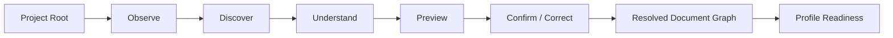
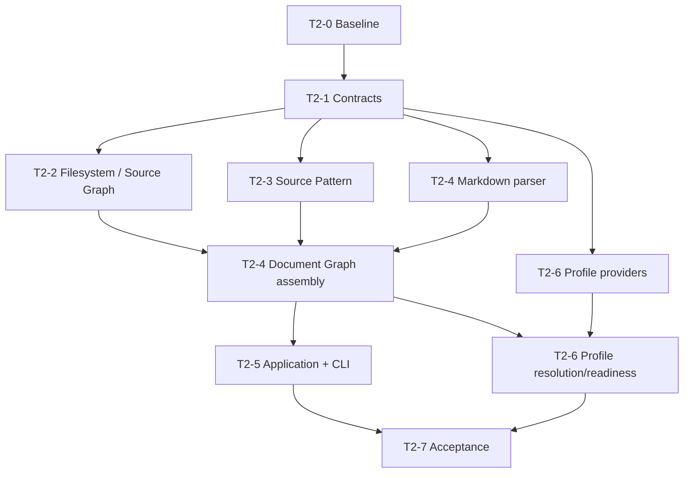

# Target — MDForge Project Discovery, Document Graph & Composable Publication Profiles

> **Promesse** : à la clôture de T2, MDForge peut recevoir un répertoire documentaire réel, **observer sa structure sans effet destructif, proposer comment il doit être lu, expliquer ses ambiguïtés, laisser confirmer/corriger cette compréhension, produire un Document Graph déterministe et inspectable, puis évaluer ce graphe contre un ou plusieurs Publication Profiles composables** — tout cela à travers la même Application API consommable par l'humain et par une future surface agentique.

T1 a rendu la modularité réelle.

T2 doit rendre **le document réel**.

```text
T1
installed capabilities
→ registry
→ dependency resolution
→ lifecycle
→ Application Runtime API

T2
project directory
→ discovery
→ candidate understanding
→ confirmation
→ Source Graph
→ Document Graph
→ Publication Profile composition
→ readiness report
```

T2 est le premier Target où MDForge commence à comprendre ce que l'Operator cherche réellement à publier.

Il ne doit cependant pas fabriquer prématurément le produit final de T3.

---

## 1. Pourquoi cette cible existe

Le Memory Diagram a fixé le théorème UX :

```text
Discover
→ Understand
→ Confirm / Correct
→ Build
```

T2 doit implémenter **les trois premières étapes** et préparer la quatrième.

Le problème utilisateur n'est pas :

> « comment configurer un scanner de fichiers ? »

Le problème utilisateur est :

> « voici mon projet ; comprends comment je l'ai organisé et dis-moi si cette compréhension est correcte. »

Cette différence gouverne toute la cible.

### 1.1 Le répertoire physique n'est pas le document

Un projet peut être organisé comme :

```text
book/
├── 01-introduction/
│   ├── 01_context.md
│   └── 02_problem.md
├── 02-method/
│   ├── 01-model.md
│   └── 02-evaluation.md
└── references/
```

ou :

```text
thesis/
├── 01_introduction.md
├── 02_related_work.md
├── 03_method.md
└── 04_results.md
```

Ces layouts sont des **indices**. Ils ne sont pas encore la vérité documentaire.

La vérité cible est un modèle logique explicite :

```text
Document
├── Chapter 1
│   ├── Section 1.1
│   │   └── Subsection 1.1.1
│   └── Section 1.2
└── Chapter 2
```

T2 établit le passage contrôlé entre les deux.

### 1.2 L'utilisateur ne pense pas comme le moteur

Le happy path doit favoriser :

> **convention-first, configuration-when-needed.**

Si MDForge peut déduire avec forte confiance qu'un répertoire correspond à un chapitre, qu'un fichier Markdown correspond à une section et qu'un titre `##` correspond à une sous-section, il doit le proposer.

Il ne doit pas exiger immédiatement un schéma technique complet.

En revanche, l'Operator doit toujours pouvoir reprendre le contrôle par configuration explicite.

### 1.3 T2 transforme l'intuition en contrat

T2 doit produire une chaîne de vérité :

```text
Physical observations
        ↓
PatternCandidate[]
        ↓
Resolved SourcePattern
        ↓
Source Graph
        ↓
Document Graph
        ↓
Publication Profile Readiness
```

Chaque transition est :

```text
typed
deterministic
inspectable
testable
explainable
```

---

## 2. Baseline post-T1 à respecter

Au baseline `1bfcd23427659db09cd831d6816209b4090faa7e`, T1 est clos.

T2 consomme les frontières publiques T1 suivantes :

```text
CapabilityIdentity
CapabilityManifest
ServiceContract
Requirement
CapabilityProvider
RuntimeContext
RuntimeEvent
StructuredError
CapabilityRegistry semantics
dependency resolution
explicit provider selection
RuntimeBundle
MdforgeApplication
```

T2 ne doit pas :

```text
importer mdforge_kernel internals depuis une capability
patcher le registry pour reconnaître un "project plugin"
créer un second plugin discovery mechanism
créer un second lifecycle
créer une seconde Application API
```

Les nouvelles capacités de T2 sont de **vrais plugins T1**, découvrables par `mdforge.capabilities`.

### 2.1 Preuves T1 à préserver

Le handoff T1 établit notamment :

```text
40 tests PASS
Ruff PASS
mypy strict PASS
five wheels build PASS
fresh install PASS
third-party plugin install/run/remove PASS
runtime rollback PASS
human/JSON runtime truth parity PASS
```

La suite T1 complète reste une régression obligatoire de T2.

### 2.2 MDDOCX

Le submodule reste au baseline :

```text
92095562b1d9b421c3c5cc7f761c16b74115c5a7
```

T2 peut utiliser les comportements historiques MDDOCX comme **corpus de besoins et fixtures de migration** :

```text
numeric ordering
NN_MM_name.md conventions
underscore-ignored sources
parent-before-child ordering
Markdown document organization
```

Mais :

```text
no import from MDDOCX
no runtime dependency on MDDOCX
no MDDOCX adapter inside kernel
no MDDOCX mutation
```

---

## 3. Résultat attendu après T2

Une installation propre doit pouvoir démontrer :

```text
$ mdforge inspect ./my-thesis

Project understood with high confidence.

Structure
  Chapters: 6
  Sections: 28
  Subsections: 74

Pattern candidate
  directory(level=1) -> chapter
  markdown file       -> section
  heading(##)         -> subsection
  prefix NN_          -> ordering

Ignored
  _notes.md
  .drafts/

Ambiguities
  MDG-DISC-004: chapter 04 contains two sections with order 02

Profile readiness
  generic-document    READY
  wust-thesis         NEEDS_ATTENTION (2)
```

Le même use case est disponible sous forme structurée :

```text
Application API
→ ProjectInspectionReport
```

et via :

```text
mdforge inspect ./my-thesis --json
```

sans divergence de données.

### 3.1 Après T2, MDForge sait

- ouvrir un projet depuis une racine filesystem autorisée ;
- charger `mdforge.toml` s'il existe ;
- observer un arbre physique de façon bornée et déterministe ;
- appliquer des règles d'ignore ;
- détecter plusieurs `SourcePattern` candidates ;
- produire une explication/evidence de chaque candidate ;
- exprimer confidence et ambiguïtés ;
- accepter un `SourcePattern` explicite ;
- confirmer une interprétation candidate ;
- persister et recharger cette compréhension ;
- détecter lorsque la structure réelle contredit la configuration ;
- parser la structure Markdown utile au graphe logique ;
- produire un Source Graph ;
- produire un Document Graph canonique ;
- préserver provenance source ↔ unité documentaire ;
- diagnostiquer les cas ambigus ou invalides ;
- charger des Publication Profiles via le runtime de capabilities ;
- composer plusieurs profiles/overlays selon des règles explicites ;
- valider le Document Graph et les métadonnées contre un profile ;
- produire un `ProfileReadinessReport` ;
- exposer le tout via la même Application API ;
- offrir une CLI d'inspection fonctionnelle mais encore utilitaire.

### 3.2 Après T2, MDForge ne sait pas encore

- offrir la Workbench chaleureuse/interactive finale ;
- fournir une GUI complète ;
- produire DOCX/PDF/HTML de bout en bout ;
- gérer un Build Plan documentaire complet ;
- gérer Build Run / Build Record / artifact ledger ;
- faire du build incrémental ;
- intégrer universellement des subprocess/services externes ;
- exposer l'Application API par un MCP complet ;
- remplacer MDDOCX ;
- offrir le packaging desktop final.

Ces frontières appartiennent aux Targets ultérieurs.

---

## 4. Théorème UX de T2



### 4.1 Observe

Observation uniquement. Aucun effet autoritaire.

MDForge observe :

```text
relative paths
directories
file extensions
Markdown files
frontmatter presence
heading structure
numeric prefixes
known ignore conventions
configured source pattern
symlinks
encoding status
```

### 4.2 Discover

Les discovery capabilities produisent des **Pattern Candidates**.

Une candidate n'est jamais une vérité.

### 4.3 Understand

La forge transforme les observations en :

```text
Source Graph Candidate
+
Document Graph Candidate
+
Diagnostics
+
Evidence
```

### 4.4 Preview

L'Operator voit la conséquence de la compréhension avant sauvegarde.

```text
No project configuration mutation
No build
No output artifact overwrite
```

### 4.5 Confirm / Correct

L'Operator peut :

```text
accept candidate
choose another candidate
provide explicit source pattern
override one ambiguous mapping
abandon without mutation
```

### 4.6 Build readiness, pas build

T2 s'arrête à :

```text
"This project is understood and is/isn't ready for profile X."
```

T3/T4 prennent ensuite le relais.

---

## 5. Modèle de domaine cible

T2 stabilise les concepts suivants sans les placer dans le kernel.

### 5.1 ProjectSpec

Minimum :

```text
project_id
schema_version
root
title?
language?
metadata
source_pattern?
publication_profiles[]
configuration_overrides
```

Contraintes :

```text
human-readable
portable
relative-path based
versionable
no secret requirement
```

### 5.2 ProjectConfiguration

`mdforge.toml` est le format canonique candidat.

Exemple indicatif :

```toml
schema = "1"

[project]
id = "my-thesis"
title = "My Thesis"
language = "en"

[discovery]
pattern = "confirmed"

[[profiles]]
id = "wust-thesis"
version = ">=1,<2"
```

Le schéma exact est livré par T2-1.

### 5.3 SourceObservation

Décrit un objet observé sans lui attribuer encore une fonction documentaire.

Minimum :

```text
relative_path
kind
extension?
size?
encoding?
depth
name_tokens
numeric_prefix?
heading_summary?
ignored?
symlink?
```

### 5.4 SourcePattern

Contrat déclaratif traduisant des indices physiques en rôles logiques.

Il doit pouvoir exprimer au minimum :

```text
directory-depth mapping
file mapping
heading-level mapping
ordering rules
ignore rules
filename token rules
frontmatter hints
fallback behavior
```

### 5.5 PatternCandidate

```text
candidate_id
source_pattern
confidence
evidence[]
ambiguities[]
diagnostics[]
```

Le score aide l'UX ; il ne constitue jamais une vérité automatique.

### 5.6 SourceGraph

Minimum :

```text
nodes[]
edges[]
ordering
ignored[]
provenance
diagnostics
fingerprint
```

Le Source Graph reste distinct du Document Graph.

### 5.7 DocumentUnit

Le modèle ne doit pas être prisonnier du seul triplet chapitre/section/sous-section.

Minimum :

```text
unit_id
kind
title?
ordinal?
metadata
source_refs[]
```

Kinds canoniques initiaux :

```text
document
part
chapter
section
subsection
appendix
frontmatter
backmatter
```

### 5.8 DocumentRelation

Minimum :

```text
contains
precedes
references_source
```

### 5.9 DocumentGraph

Minimum :

```text
graph_id
schema_version
root_unit
units[]
relations[]
source_graph_fingerprint
diagnostics[]
```

Propriétés :

```text
deterministic
stable IDs under stable inputs when practical
serializable
inspectable
source-traceable
renderer-independent
profile-independent
```

### 5.10 DiscoveryDiagnostic

Minimum :

```text
code
severity
message
source_ref?
document_unit_id?
action_hint?
evidence?
```

Sévérités :

```text
info
warning
error
blocking
```

### 5.11 ProjectInspectionReport

DTO applicatif commun à toutes les surfaces.

Minimum :

```text
project
observations_summary
pattern_candidates[]
resolved_pattern?
source_graph?
document_graph?
diagnostics[]
profile_readiness[]
readiness
```

---

## 6. Publication Profiles : frontière et sémantique

### 6.1 RuntimeBundle ≠ PublicationProfile

```text
RuntimeBundle
= quelles capabilities doivent être actives et avec quels providers/configs

PublicationProfile
= quelles conventions/contraintes/intents documentaires s'appliquent au projet
```

Un Publication Profile peut requérir des services qui conduisent à une composition runtime, mais il n'est pas lui-même le runtime.

### 6.2 PublicationProfileSpec

Minimum :

```text
id
version
title
description
required_project_metadata
required_document_constraints
required_services[]
optional_services[]
defaults
output_intents[]
compatibility
```

### 6.3 Profile composition

Un projet peut appliquer :

```text
generic-document
+ thesis
+ wust-thesis
```

La composition est :

```text
ordered
explicit
versioned
conflict-aware
inspectable
```

### 6.4 Merge policy

Interdit :

```text
silent last-write-wins
implicit deep merge of arbitrary dicts
```

Obligatoire :

```text
set union where semantics are additive
explicit override where a scalar must change
conflict diagnostic otherwise
```

### 6.5 ProfileReadinessReport

Minimum :

```text
profile_id
profile_version
ready
requirements[]
violations[]
warnings[]
required_services[]
missing_services[]
```

Ce n'est pas encore un Build Plan.

---

## 7. Capabilities T2 attendues

Les noms exacts des packages peuvent évoluer pendant T2-1 ; les responsabilités restent distinctes.

```text
project.filesystem-observer
project.source-pattern
document.markdown-structure
document.graph-assembler
publication.profile-provider
```

### 7.1 `project.filesystem-observer`

```text
filesystem root
→ SourceObservation[]
```

Ne décide jamais :

```text
chapter
section
publication profile
```

### 7.2 `project.source-pattern`

```text
observations
+ optional explicit configuration
→ PatternCandidate[]
/ Resolved SourcePattern
```

Le kernel ne connaît aucune de ses heuristiques.

### 7.3 `document.markdown-structure`

```text
Markdown source
→ structural tokens / heading outline / metadata hints
```

Il ne produit pas directement un renderer AST.

`markdown-it-py` est une candidate interne à évaluer par spike pour :

```text
headings
source maps
Unicode
frontmatter interaction
malformed Markdown behavior
```

Le choix de librairie reste une implementation detail de la capability.

### 7.4 `document.graph-assembler`

```text
Source Graph
+ Resolved SourcePattern
+ parsed structure
→ Document Graph
```

### 7.5 `publication.profile-provider`

```text
provide PublicationProfileSpec
```

Un profile doit pouvoir être livré par package tiers via le runtime T1.

---

## 8. Sécurité filesystem et portabilité

T2 introduit le premier contact réel avec les fichiers utilisateur.

### 8.1 Project root boundary

Par défaut :

```text
no traversal outside project root
```

Les chemins sont normalisés en chemins relatifs de projet.

### 8.2 Symlink policy

Baseline :

```text
symlink inside root: inspectable/configurable
symlink escaping root: rejected by default
```

### 8.3 Encoding

Baseline :

```text
UTF-8 preferred
UTF-8 BOM supported
invalid/unknown encoding → structured diagnostic
```

### 8.4 Cross-platform paths

Golden tests obligatoires pour :

```text
spaces
Unicode
accented names
CJK names
Windows-style edge cases
nested paths
case-sensitivity assumptions
```

---

## 9. Identité, déterminisme et fingerprints

### 9.1 Stable ordering

L'ordre filesystem brut est interdit comme autorité.

Ordre résolu :

```text
explicit pattern order
numeric prefix
configured ordering
stable lexical fallback
```

### 9.2 Stable unit IDs

Lorsque les inputs structurels ne changent pas, les `DocumentUnit` conservent des IDs stables autant que possible.

Candidate :

```text
hash(project-relative source identity + logical role + structural locator)
```

### 9.3 Fingerprints

Minimum :

```text
observation fingerprint
source graph fingerprint
document graph fingerprint
profile composition fingerprint
```

Ils préparent T4 sans créer encore de cache/ledger.

---

## 10. Diagnostics et confidence

### 10.1 Confidence n'est pas de l'IA magique

T2 ne requiert aucun LLM.

Les heuristiques sont :

```text
deterministic
explainable
bounded
testable
```

### 10.2 États de compréhension

L'Application API distingue :

```text
high-confidence candidate
ambiguous candidates
no viable candidate
explicit configured pattern
confirmed pattern
```

### 10.3 Diagnostics minimum

Namespace candidat :

```text
MDG-PROJ-001 invalid project config
MDG-FS-001 unreadable source
MDG-FS-002 path escape
MDG-FS-003 unsupported encoding
MDG-DISC-001 no viable pattern
MDG-DISC-002 ambiguous mapping
MDG-DISC-003 orphan source
MDG-DISC-004 duplicate ordering
MDG-DISC-005 conflicting role
MDG-DOC-001 graph cycle
MDG-DOC-002 missing logical parent
MDG-DOC-003 unstable order
MDG-PROFILE-001 missing project metadata
MDG-PROFILE-002 unmet document constraint
MDG-PROFILE-003 profile conflict
MDG-PROFILE-004 missing required service
```

Les codes finaux sont stabilisés dans T2-1/T2-3.

---

## 11. Topologie de repository cible

T2 étend le workspace T1 sans déplacer ses fondations.

```text
Mdforge/
├── packages/
│   ├── contracts/
│   ├── kernel/
│   ├── application/
│   ├── cli/
│   ├── project/
│   │   └── src/mdforge_project/
│   ├── plugins/
│   │   ├── reference/
│   │   ├── filesystem-observer/
│   │   ├── source-pattern/
│   │   ├── markdown-structure/
│   │   └── document-graph/
│   └── profiles/
│       ├── generic-document/
│       ├── thesis/
│       └── wust-thesis/
├── tests/
│   ├── contracts/
│   ├── project/
│   ├── plugins/
│   ├── integration/
│   ├── acceptance/
│   └── fixtures/
└── docs/architecture/
```

### 11.1 Package `project`

Package de domaine pur.

Autorisé à dépendre de :

```text
contracts
stdlib
minimal schema dependencies explicitly justified
```

Interdit :

```text
kernel internals
cli
Rich/Typer
MDDOCX
renderer
Word
```

### 11.2 Application

`MdforgeApplication` est étendue ; aucune seconde façade.

### 11.3 CLI

La CLI traduit :

```text
human command
→ Application API
→ DTO
→ human or JSON rendering
```

---

## 12. Application API à étendre

Responsabilités obligatoires :

```text
inspect_project(root, options) -> ProjectInspectionReport
load_project(root) -> ProjectView
list_pattern_candidates(root) -> PatternCandidatesView
confirm_pattern(root, candidate_id | explicit_pattern) -> ProjectView
clear_pattern_confirmation(root) -> ProjectView
inspect_document_graph(root) -> DocumentGraphView
list_publication_profiles() -> ProfileListView
resolve_profiles(root, profiles) -> ResolvedProfileComposition
check_profile_readiness(root, profiles) -> ProfileReadinessView
```

### 12.1 Read-only by default

```text
inspect_project
list_pattern_candidates
inspect_document_graph
list_publication_profiles
check_profile_readiness
```

### 12.2 Mutations explicites

```text
confirm_pattern
clear_pattern_confirmation
project config update
```

La mutation est :

```text
atomic
validated before replace
rollback-safe
```

---

## 13. CLI minimale T2

Surface candidate :

```text
mdforge inspect .
mdforge inspect . --json
mdforge inspect . --explain

mdforge project patterns .
mdforge project confirm . --candidate <id>

mdforge profiles
mdforge profile inspect wust-thesis
mdforge profile check . --profile wust-thesis
```

Le Target peut simplifier les noms après test UX.

Principe : la CLI expose la **compréhension utilisateur**, pas la plomberie runtime.

---

## 14. Fixtures de référence obligatoires

### Fixture A — `simple-book`

```text
01-introduction/
  01_context.md
  02_scope.md
02-method/
  01_architecture.md
```

Attendu :

```text
directory -> chapter
file -> section
H2 -> subsection
```

### Fixture B — `flat-numbered-report`

```text
01_intro.md
02_method.md
03_results.md
```

Attendu :

```text
file -> chapter
H2 -> section
```

### Fixture C — `nested-thesis`

```text
01_introduction/
  01_background/
    content.md
  02_problem/
    content.md
```

### Fixture D — `mddocx-legacy-shape`

Reproduit sans dépendance :

```text
NN_MM_name.md
leading underscore ignored
parent before nested/subsection
```

### Fixture E — `ambiguous-project`

Contient :

```text
duplicate numeric prefixes
orphan files
mixed section conventions
```

Attendu : aucune confirmation silencieuse.

### Fixture F — `unicode-and-spaces`

Inclut accents, CJK, espaces et imbrication.

### Fixture G — `profile-ready-wust-like`

Projet miniature permettant de démontrer un Publication Profile thèse/WUST sans renderer.

---

# 15. Marches d'implémentation

## T2-0 — Reconnaissance post-T1 et contract freeze review

- [ ] **Promesse** : confirmer les frontières réelles T1 et verrouiller les nouveaux contrats T2 avant parallélisation.

### Lots

#### Lot A — baseline

- [ ] fetch + compare `master` ;
- [ ] vérifier SHA T1 ;
- [ ] vérifier `Mddocx` gitlink ;
- [ ] exécuter les gates T1 avant changement ;
- [ ] lire `docs/architecture/t1-foundation-handoff.md`.

#### Lot B — contract inventory

- [ ] cartographier les contrats T1 consommés ;
- [ ] identifier les nouveaux contrats domaine T2 ;
- [ ] documenter dépendances autorisées/interdites.

#### Lot C — implementation topology

- [ ] confirmer ou ajuster `packages/project` ;
- [ ] confirmer packages plugins T2 ;
- [ ] produire matrice `owned_paths` pour agents parallèles.

### Gate T2-0

```text
T1 full regression PASS
current baseline recorded
T2 public contracts list frozen
no kernel change required for project domain
parallel owned_paths established
```

### Stop condition

Si `Project`, `Markdown`, `DocumentGraph` ou `PublicationProfile` doivent entrer dans le kernel : **STOP → architecture review**.

---

## T2-1 — Project Model, configuration & Document Graph contracts

- [ ] **Promesse** : MDForge possède un modèle de projet et un IR documentaire publics, purs et versionnés avant leurs implémentations.

### Lot A — Project contracts

- [ ] `ProjectSpec` ;
- [ ] schema version ;
- [ ] metadata ;
- [ ] `SourcePattern` ;
- [ ] `PatternCandidate` ;
- [ ] `PatternEvidence` ;
- [ ] confirmation state.

`owned_paths` :

```text
packages/project/src/mdforge_project/project*.py
packages/project/src/mdforge_project/pattern*.py
tests/project/test_project_contracts*.py
```

### Lot B — Graph contracts

- [ ] `SourceObservation` ;
- [ ] `SourceGraph` ;
- [ ] `DocumentUnit` ;
- [ ] `DocumentRelation` ;
- [ ] `DocumentGraph` ;
- [ ] stable serialization.

`owned_paths` :

```text
packages/project/src/mdforge_project/source_graph*.py
packages/project/src/mdforge_project/document_graph*.py
tests/project/test_graph_contracts*.py
```

### Lot C — Diagnostics

- [ ] diagnostic codes ;
- [ ] severity ;
- [ ] source location ;
- [ ] action hints ;
- [ ] confidence ;
- [ ] readiness classification.

`owned_paths` :

```text
packages/project/src/mdforge_project/diagnostics*.py
tests/project/test_diagnostics*.py
```

### Lot D — Publication profile contracts

- [ ] `PublicationProfileSpec` ;
- [ ] `ProfileComposition` ;
- [ ] `ProfileConstraint` ;
- [ ] `ProfileReadinessReport` ;
- [ ] merge/conflict semantics.

`owned_paths` :

```text
packages/project/src/mdforge_project/profiles*.py
tests/project/test_profile_contracts*.py
```

### Gate T2-1

```text
deterministic round-trip serialization
invalid project config rejected
invalid graph rejected
profile conflicts diagnosed
project package has no kernel/cli/renderer/MDDOCX imports
```

---

## T2-2 — Filesystem Observation & Source Graph foundation

- [ ] **Promesse** : une capability T1 observe un répertoire de manière déterministe, bornée et portable sans décider de sa sémantique documentaire.

### Lot A — filesystem observer capability

- [ ] entry point `mdforge.capabilities` ;
- [ ] manifest/service contracts ;
- [ ] recursive traversal ;
- [ ] stable relative paths ;
- [ ] ignore rules ;
- [ ] encoding inspection ;
- [ ] symlink boundary policy.

`owned_paths` :

```text
packages/plugins/filesystem-observer/**
```

### Lot B — Source Graph builder

- [ ] observations → nodes/edges ;
- [ ] stable order ;
- [ ] fingerprint ;
- [ ] ignored-source capture ;
- [ ] source diagnostics.

`owned_paths` :

```text
packages/project/src/mdforge_project/source_builder*.py
tests/plugins/test_filesystem_observer*.py
```

### Lot C — portability fixtures

- [ ] spaces ;
- [ ] Unicode ;
- [ ] nested paths ;
- [ ] symlink escape ;
- [ ] invalid encoding ;
- [ ] deterministic results.

### Gate T2-2

```text
same tree → same Source Graph
filesystem enumeration order irrelevant
no path escape
ignored sources inspectable
Unicode/space fixture PASS
observer install/remove without kernel patch
```

---

## T2-3 — Source Pattern inference, explicit configuration & confirmation

- [ ] **Promesse** : MDForge peut proposer comment lire un projet, expliquer pourquoi, accepter une correction et persister une compréhension confirmée.

### Lot A — explicit SourcePattern

- [ ] TOML representation ;
- [ ] validator ;
- [ ] pattern application ;
- [ ] ordering rules ;
- [ ] ignore rules ;
- [ ] heading mapping rules.

`owned_paths` :

```text
packages/plugins/source-pattern/src/**/explicit*.py
tests/plugins/test_explicit_source_pattern*.py
```

### Lot B — inference engine

- [ ] heuristics ;
- [ ] evidence ;
- [ ] confidence ;
- [ ] ambiguity detection ;
- [ ] no auto-confirm side effect.

`owned_paths` :

```text
packages/plugins/source-pattern/src/**/inference*.py
tests/plugins/test_pattern_inference*.py
```

### Lot C — project configuration persistence

- [ ] `mdforge.toml` read ;
- [ ] validation before write ;
- [ ] atomic replacement ;
- [ ] confirmed pattern persistence ;
- [ ] clear/reset ;
- [ ] failure leaves valid previous config.

`owned_paths` :

```text
packages/project/src/mdforge_project/config*.py
tests/project/test_project_config*.py
```

### UX scenarios obligatoires

```text
obvious      → candidate + preview + explicit confirmation
ambiguous    → multiple candidates, no implicit selection
explicit     → user pattern validated and applied
contradiction→ persisted pattern challenged, never silently reinterpreted
```

### Gate T2-3

```text
convention-first works
configuration-when-needed works
inspection remains read-only
confirmation mutation atomic
same observations + rules → same candidates/order/confidence
```

---

## T2-4 — Markdown structural parsing & Document Graph assembly

- [ ] **Promesse** : MDForge transforme une compréhension confirmée des sources en Document Graph canonique, renderer-independent et traçable.

### Lot A — Markdown structure capability

- [ ] heading outline ;
- [ ] title extraction ;
- [ ] frontmatter hints ;
- [ ] source spans/line locations si disponibles ;
- [ ] malformed Markdown diagnostics ;
- [ ] parser spike/decision.

`owned_paths` :

```text
packages/plugins/markdown-structure/**
tests/plugins/test_markdown_structure*.py
```

### Lot B — Document Graph assembler capability

- [ ] map source roles → `DocumentUnit` ;
- [ ] hierarchy ;
- [ ] ordering ;
- [ ] provenance ;
- [ ] stable unit identity ;
- [ ] graph fingerprint.

`owned_paths` :

```text
packages/plugins/document-graph/**
tests/plugins/test_document_graph_assembler*.py
```

### Lot C — graph validation

- [ ] duplicate order ;
- [ ] orphan ;
- [ ] missing logical parent ;
- [ ] conflicting role ;
- [ ] illegal cycle ;
- [ ] source missing after observation.

### Gate T2-4

Golden files pour fixtures A-D/F :

```text
Source Graph
Resolved SourcePattern
Document Graph
Diagnostics
```

Gate :

```text
deterministic canonical serialization
stable unit IDs on unchanged fixture
source provenance complete
no renderer dependency
```

---

## T2-5 — Project Inspection Application API & inspect-first CLI

- [ ] **Promesse** : humain et machine consomment la même compréhension projet par `MdforgeApplication`.

### Lot A — application use cases

- [ ] `inspect_project` ;
- [ ] `list_pattern_candidates` ;
- [ ] `confirm_pattern` ;
- [ ] `clear_pattern_confirmation` ;
- [ ] `inspect_document_graph`.

`owned_paths` :

```text
packages/application/**
tests/integration/test_project_application*.py
```

### Lot B — DTO truth

- [ ] `ProjectInspectionReport` ;
- [ ] stable JSON ;
- [ ] diagnostics ;
- [ ] candidate evidence ;
- [ ] readiness.

### Lot C — CLI inspection

- [ ] `mdforge inspect` ;
- [ ] human output ;
- [ ] `--json` ;
- [ ] explain/evidence view ;
- [ ] explicit confirmation command.

`owned_paths` :

```text
packages/cli/**
tests/acceptance/test_project_cli*.py
```

### UX gate

Un humain comprend :

```text
what MDForge found
how it interpreted it
what it ignored
what is ambiguous
what action is needed
```

sans connaître registry/service-context/entry-points.

### Gate T2-5

```text
mdforge inspect simple-book PASS
human + JSON same DTO truth
ambiguous fixture actionable
confirmation round-trip PASS
no Rich/Typer import in application/project/plugins
```

---

## T2-6 — Composable Publication Profiles & readiness

- [ ] **Promesse** : les conventions de publication deviennent des compositions versionnées et remplaçables évaluant un Document Graph sans renderer.

### Lot A — profile provider capability

- [ ] service contract profile provider ;
- [ ] discovery via T1 runtime ;
- [ ] versioned profile identity ;
- [ ] list/get profile API.

`owned_paths` :

```text
packages/profiles/**
packages/project/src/mdforge_project/profile_registry*.py
```

### Lot B — composition resolver

- [ ] ordered composition ;
- [ ] additive requirements ;
- [ ] explicit overrides ;
- [ ] conflict diagnostics ;
- [ ] composition fingerprint.

`owned_paths` :

```text
packages/project/src/mdforge_project/profile_resolution*.py
tests/project/test_profile_resolution*.py
```

### Lot C — readiness evaluator

- [ ] project metadata requirements ;
- [ ] Document Graph constraints ;
- [ ] required capability services ;
- [ ] warnings vs blockers ;
- [ ] `ProfileReadinessReport`.

### Lot D — reference profiles

Minimum :

```text
generic-document
thesis
wust-thesis
```

Le `wust-thesis` T2 définit des attentes de structure/métadonnées/services mais **ne rend pas DOCX et n'invoque pas Word**.

### Gate T2-6

```text
profile package install/remove without kernel patch
generic + thesis + wust composition deterministic
conflicts explicit
WUST-like fixture readiness correct
no renderer
no Word/COM
```

---

## T2-7 — Acceptance end-to-end, regression & handoff T3

- [ ] **Promesse** : MDForge comprend réellement plusieurs projets et fournit à T3 une frontière stable pour construire la Workbench et le forging end-to-end.

### Acceptance A — new project, no config

```text
fresh install
→ inspect simple-book
→ candidate generated
→ graph preview
→ no mutation
→ confirm candidate
→ mdforge.toml atomically persisted
→ re-inspect
→ same Document Graph
```

### Acceptance B — ambiguous project

```text
inspect
→ multiple candidates / diagnostics
→ no auto-confirm
→ explicit choice/pattern
→ graph resolved
```

### Acceptance C — MDDOCX-shaped legacy project

```text
legacy-shaped fixture
→ numeric/underscore conventions understood
→ expected ordering
→ no MDDOCX runtime dependency
```

### Acceptance D — profile readiness

```text
resolved WUST-like project
→ generic-document + thesis + wust-thesis
→ composition resolved
→ missing metadata actionable
→ fix metadata
→ readiness = READY
```

### Acceptance E — plugin modularity

```text
install alternate source-pattern capability
→ provider appears
→ explicit selection
→ inspection uses it
→ remove it
→ default remains functional
→ kernel unchanged
```

### Quality gates

- [ ] T1 regression PASS ;
- [ ] T2 unit/integration/acceptance PASS ;
- [ ] Ruff PASS ;
- [ ] strict mypy PASS ;
- [ ] all workspace packages build ;
- [ ] fresh wheel-only install PASS ;
- [ ] no Word/COM ;
- [ ] no daemon ;
- [ ] no database required ;
- [ ] no network required for T2 happy path ;
- [ ] MDDOCX gitlink unchanged ;
- [ ] kernel domain-vocabulary fitness PASS.

### Handoff T3 obligatoire

`docs/architecture/t2-project-understanding-handoff.md` contient :

```text
baseline/final SHAs
new public contracts
ProjectInspectionReport schema
DocumentGraph schema/version
SourcePattern schema/version
PublicationProfile schema/version
CLI available
profile packages
fixture catalog
known UX limitations
T3 handshakes
proof task IDs
```

### Gate T2-7

T2 est clos uniquement si T3 peut construire une UI/Workbench sur les use cases publics **sans importer les internals des discovery plugins ni du kernel**.

---

## 16. Parallélisation recommandée

Après T2-1, plusieurs corridors avancent en parallèle.



### Corridors agents

```text
Contracts Agent  → packages/project contracts + contract tests
Filesystem Agent → filesystem-observer + fixtures
Pattern Agent    → source-pattern inference/explicit
Markdown Agent   → markdown-structure
Graph Agent      → document-graph assembler
Profiles Agent   → profiles + resolution/readiness
Application Agent→ use cases + CLI after contract freeze
```

Les `owned_paths` ne doivent pas se chevaucher hors points d'intégration prévus.

---

## 17. Handshakes inter-targets

### T1 → T2

T2 consomme le capability runtime, registry, service resolution, lifecycle, RuntimeBundle et MdforgeApplication.

T2 ne modifie T1 que si un **contract bug générique prouvé** l'exige.

### T2 → T3

T3 reçoit :

```text
ProjectSpec
SourcePattern
PatternCandidate
ProjectInspectionReport
SourceGraph
DocumentGraph
PublicationProfileSpec
ProfileComposition
ProfileReadinessReport
application use cases
inspect/profile CLI baseline
```

T3 peut se concentrer sur :

```text
warm UX
Workbench
UI
guided project setup
preview
end-to-end forging
```

### T2 → T4

T4 reçoit graph/profile fingerprints et inputs stables pour Build Plan/Run/Record/CAS/incremental.

### T2 → T5

T5 généralise native capabilities vers executable/service/MCP/platform capabilities.

### T2 → T6

T6 expose les use cases T2 par MCP ; T2 fournit déjà des DTOs structurés.

### T2 → T7

T7 réutilise fixtures legacy/parity T2 pour retirer MDDOCX.

---

## 18. Stop conditions

### SC-1 — kernel leak

Project/Markdown/Profile logic entre dans `mdforge_kernel` → **STOP**.

### SC-2 — renderer coupling

Document Graph encode DOCX/Word/PDF/HTML layout → **STOP**.

### SC-3 — implicit configuration

Une inference candidate est persistée sans confirmation explicite → **STOP**.

### SC-4 — nondeterminism

Même input produit order/graph différent → **STOP**.

### SC-5 — second application truth

CLI/profile code réimplémente project understanding → **STOP**.

### SC-6 — MDDOCX dependency

Une capability T2 importe/exécute MDDOCX comme backend → **STOP**.

### SC-7 — profile becomes renderer

Un Publication Profile génère un artifact final → **STOP**.

### SC-8 — hidden filesystem authority

Lecture hors project root sans autorité explicite → **STOP**.

---

## 19. Fitness functions architecturales

- [ ] **FF-1 Kernel vocabulary** — aucun symbole métier Project/Markdown/Chapter/DocumentGraph/Profile/WUST/DOCX dans kernel.
- [ ] **FF-2 Plugin independence** — aucun plugin T2 n'importe l'implémentation d'un autre plugin.
- [ ] **FF-3 Application-only orchestration** — surfaces consomment `MdforgeApplication`.
- [ ] **FF-4 Project model purity** — package project indépendant de kernel internals/CLI/renderer/MDDOCX.
- [ ] **FF-5 Inspect read-only** — `inspect_project` n'écrit aucun fichier.
- [ ] **FF-6 Explicit confirmation** — configuration canonique mutée seulement par action explicite.
- [ ] **FF-7 Deterministic graphs** — golden serialization stable.
- [ ] **FF-8 Provenance** — chaque unité documentaire remonte à sa source.
- [ ] **FF-9 Profile/renderer orthogonality** — aucun renderer dans profile packages.
- [ ] **FF-10 Human/machine parity** — human CLI et JSON proviennent du même DTO.
- [ ] **FF-11 T1 regression** — acceptance constitutionnelle T1 verte.

---

## 20. Tests minimaux obligatoires

### Unit

```text
ProjectSpec validation
SourcePattern validation
pattern candidate scoring
source ordering
DocumentUnit identity
graph validation
profile merge/conflict
readiness constraints
```

### Contract

```text
T2 plugin manifests
service requirements
profile provider contract
schema serialization stability
```

### Integration

```text
T1 runtime + filesystem observer
T1 runtime + source-pattern
T1 runtime + markdown parser
T1 runtime + graph assembler
Application API full inspection
profile provider installation/discovery
```

### Acceptance

```text
fixtures A-G
human CLI
JSON CLI
config confirmation
fresh install
alternate plugin
legacy-shaped project
```

### Negative

```text
path escape
duplicate order
invalid config
malformed Markdown
missing profile service
profile conflict
ambiguous pattern
unreadable file
symlink outside root
```

---

## 21. Performance & resource expectations

T2 ne livre pas l'incrémental T4 mais ne doit pas introduire un design manifestement non scalable.

Fixture benchmark recommandée :

```text
1,000 Markdown files
10,000 structural headings
moderate nested tree
```

Attentes :

```text
bounded memory
no quadratic all-pairs graph algorithm
no unnecessary repeated parse inside one inspection
diagnostics collection bounded
```

Les timings sont documentés comme mesures, pas comme promesses universelles.

---

## 22. Observability T2

Réutiliser `RuntimeEvent` pour lifecycle capability et ajouter des événements applicatifs/domain sans polluer le kernel :

```text
project.observation.started
project.observation.completed
project.pattern.candidate
project.pattern.confirmed
project.graph.resolved
project.graph.failed
profile.composition.resolved
profile.readiness.completed
```

Pas de contenu source complet dans les logs par défaut.

---

## 23. Politique de mutations projet

T2 introduit une mutation canonique : `mdforge.toml`.

### Atomicity

```text
serialize candidate config
→ validate serialized representation
→ write temp on same filesystem
→ atomic replace
```

### No source mutation

T2 ne modifie jamais les fichiers Markdown source.

### Schema migrations

Aucune migration silencieuse destructive.

---

## 24. Schema versioning

Doivent être versionnés :

```text
ProjectSpec
SourcePattern
SourceGraph
DocumentGraph
PublicationProfileSpec
```

Règle :

```text
read compatible old schema
or
fail with actionable migration diagnostic
```

---

## 25. UX acceptance language

Mauvais :

```text
Requirement mdforge.service.project.pattern provider resolution ambiguous
```

Bon :

```text
MDForge found two equally plausible ways to interpret this project.

1. Folders are chapters; Markdown files are sections.
2. Markdown files are chapters.

Review the preview and confirm the intended structure.
```

Le JSON conserve les codes/identifiants techniques nécessaires.

---

## 26. Publication profile examples

### `generic-document`

```text
resolved Document Graph
at least one content unit
valid project identity
```

### `thesis`

Ajoute :

```text
title metadata
author metadata
abstract/frontmatter expectation
chapter-like main body
references capability intent
```

### `wust-thesis`

Ajoute des contraintes WUST comme **publication contract**, sans rendu :

```text
required metadata
expected frontmatter units
chapter structure constraints
required future service intents
```

T2 n'implémente pas les styles Word WUST.

---

## 27. Définition de terminé

T2 est **CLOS** seulement si toutes les conditions suivantes sont vraies :

- [ ] T1 regression complète PASS ;
- [ ] ProjectSpec versionné/testé ;
- [ ] `mdforge.toml` validé et atomiquement modifiable ;
- [ ] SourcePattern explicite opérationnel ;
- [ ] inference SourcePattern déterministe ;
- [ ] candidates avec evidence/confidence ;
- [ ] ambiguity path sans auto-confirm ;
- [ ] filesystem observer borné au project root ;
- [ ] Source Graph déterministe ;
- [ ] Markdown structural parser capability opérationnelle ;
- [ ] Document Graph déterministe et renderer-independent ;
- [ ] provenance source ↔ document unit prouvée ;
- [ ] diagnostics structurés/actionnables ;
- [ ] `MdforgeApplication.inspect_project()` ou équivalent stable ;
- [ ] `mdforge inspect .` humain opérationnel ;
- [ ] `mdforge inspect . --json` même vérité ;
- [ ] pattern confirmation persistée atomiquement ;
- [ ] profile provider capability opérationnelle ;
- [ ] PublicationProfileSpec versionné ;
- [ ] profile composition déterministe ;
- [ ] conflicts explicites ;
- [ ] ProfileReadinessReport opérationnel ;
- [ ] profiles `generic-document`, `thesis`, `wust-thesis` prouvés ;
- [ ] alternate project capability install/remove sans patch kernel ;
- [ ] fresh wheel-only install PASS ;
- [ ] all tests/lint/typecheck/build PASS ;
- [ ] no Word/COM ;
- [ ] no required daemon/network/database ;
- [ ] MDDOCX gitlink intact ;
- [ ] handoff T3 rédigé avec contrats et preuves.

---

## 28. Critère constitutionnel final

```text
Given
  a fresh MDForge installation
  and a Markdown project unknown to MDForge

When
  the Operator asks MDForge to inspect it

Then
  MDForge observes the project without mutation,
  proposes one or more explainable interpretations,
  produces an inspectable candidate Document Graph,
  surfaces ambiguities instead of guessing,
  allows explicit confirmation/correction,
  persists only the confirmed project-reading contract,
  reconstructs the same Document Graph deterministically,
  composes publication profiles,
  and explains profile readiness

While
  the kernel remains document-agnostic,
  the source files remain untouched,
  MDDOCX remains unused,
  and human/machine surfaces consume the same Application truth.
```

C'est cette propriété qui autorise T3.

---

## 29. Handoff attendu vers T3

À la clôture de T2, T3 doit pouvoir commencer par :

```text
load project
→ inspect project
→ show logical structure
→ resolve ambiguity
→ select profile
→ show readiness
```

sans créer de nouvelle logique de compréhension documentaire.

T3 reçoit donc :

```text
Project understanding
+ Document Graph
+ Publication Profiles
+ Application API
```

et peut consacrer son énergie à :

```text
warm interface
excellent user experience
guided workflows
preview
renderer integration
end-to-end document forging
```

> **T1 a rendu MDForge extensible. T2 doit le rendre capable de comprendre. T3 pourra alors le rendre agréable et réellement productif.**
